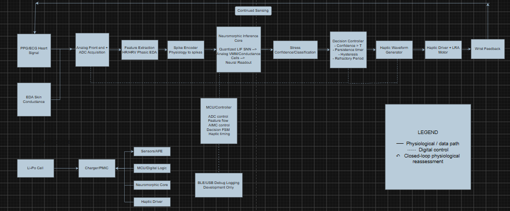
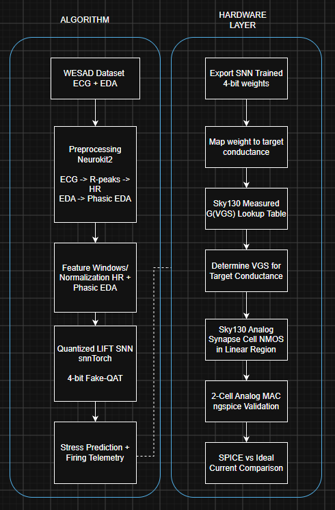
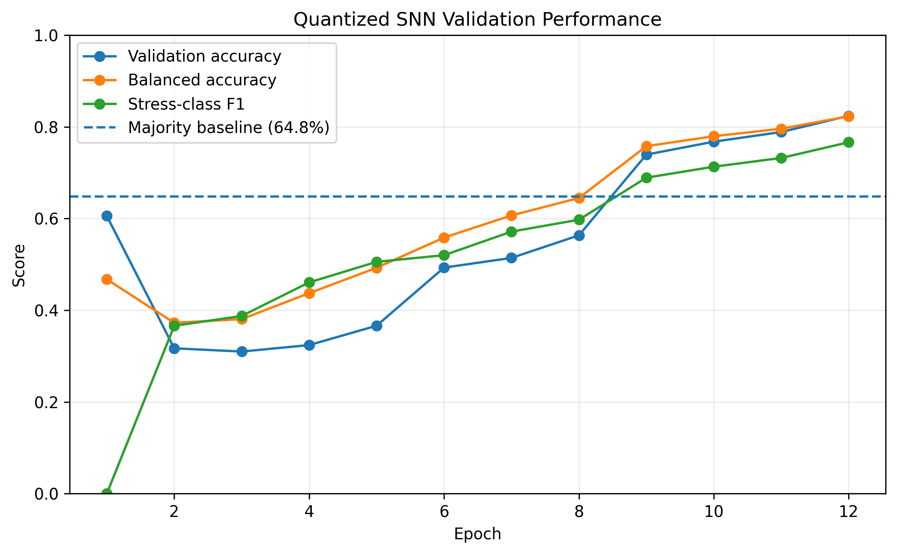
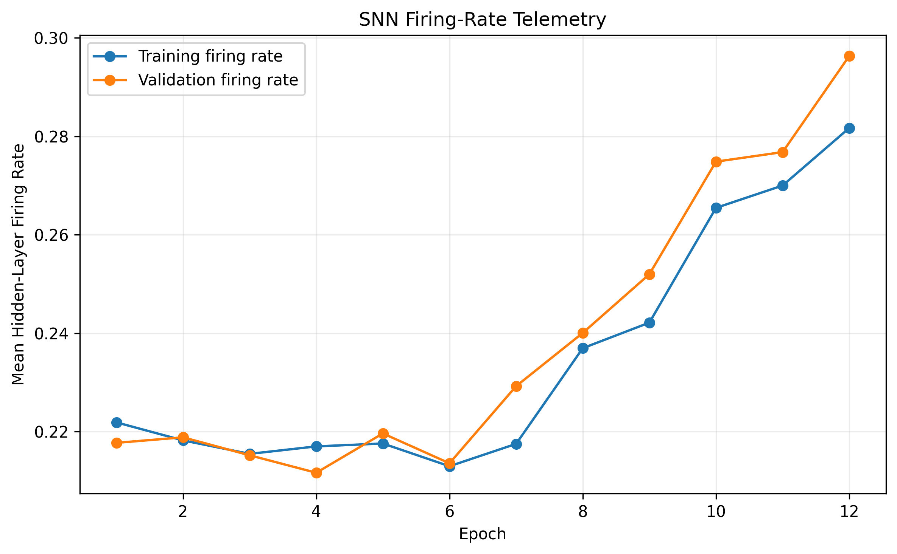
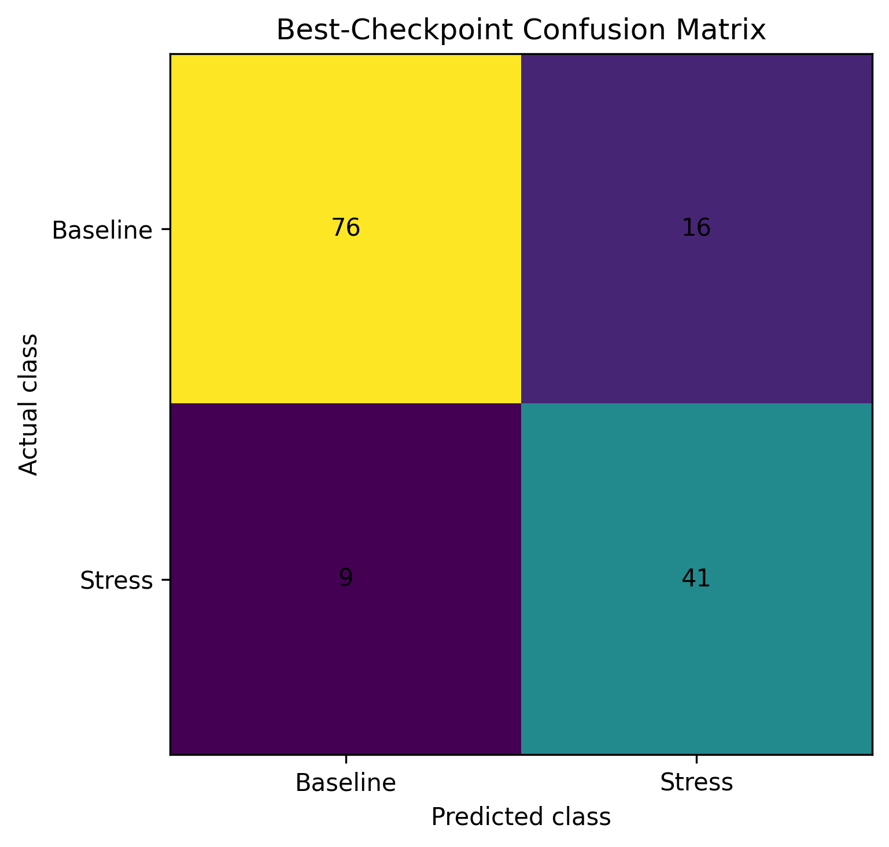
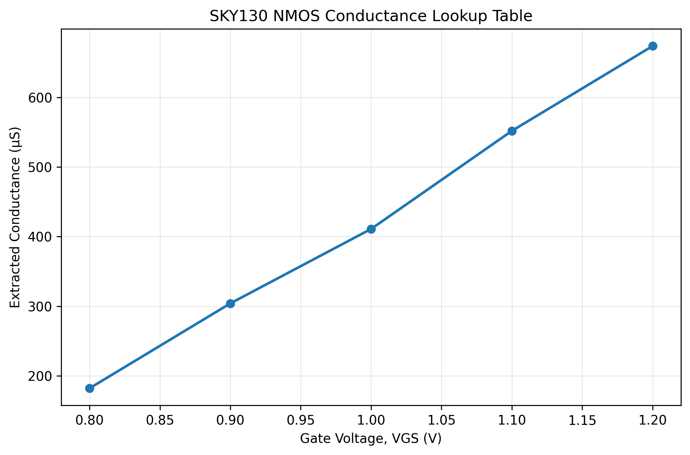
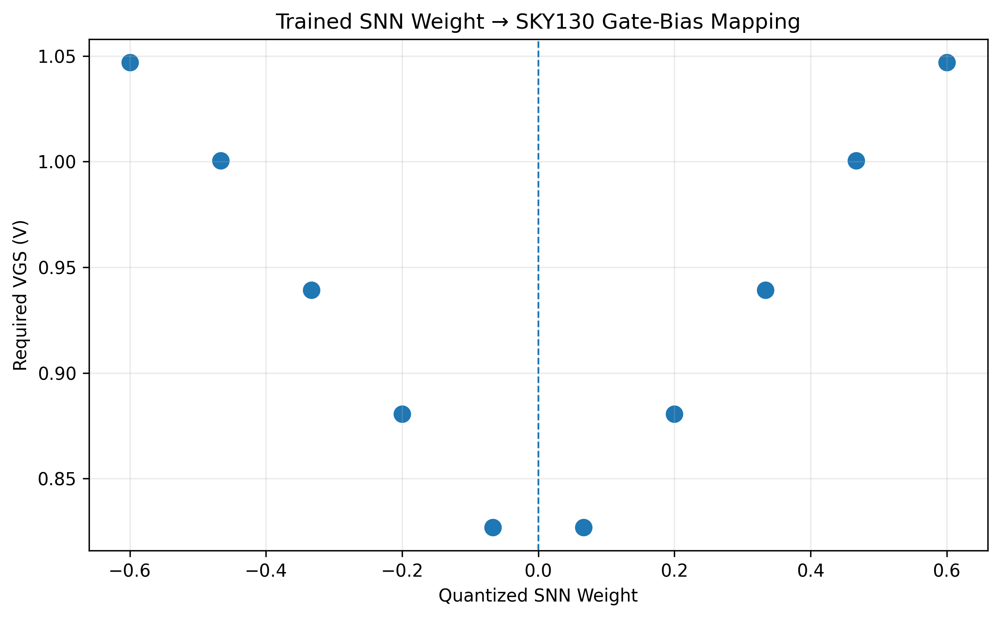
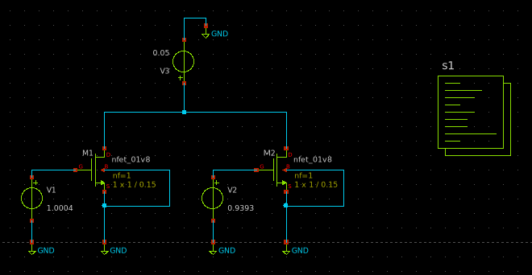

# Neuromorphic Stress-Responsive Wearable
### Low-Power Physiological Stress Detection + Heartbeat-Like Haptic Feedback

**Project:** Neuromorphic stress-responsive wearable for physiological stress monitoring  
**Current Phase:** Phase 1 — quantized SNN + SKY130 analog-compute proof of concept  
**Long-Term Application:** A discreet wearable intended to detect sustained physiological stress and trigger a heartbeat-like haptic cue at the wrist  
**Tools:** Python, PyTorch, snnTorch, NeuroKit2, Xschem, ngspice, SKY130 PDK  
**Architecture Inspiration:** Neuromorphic and low-data-movement accelerators including IBM HERMES and NorthPole  
**Repository:** [Source code and simulations](YOUR_REPOSITORY_URL)

> **I am developing the inference architecture for a closed-loop wearable that detects sustained physiological stress locally and responds with a private heartbeat-like haptic stimulus at the wrist. Phase 1 focuses on the neuromorphic inference engine: physiological feature extraction, a 4-bit quantized spiking neural network, and mapping its real trained weights onto physically characterized SKY130 analog conductance cells.**

---

## Motivation

The long-term motivation for this project is a discreet wearable intended for children exposed to chronic or traumatic stress, including displaced and refugee children.

Periods of acute physiological arousal may not always be communicated verbally. A continuously sensing wearable could potentially identify sustained physiological changes associated with stress and provide a private tactile cue without requiring the user to interact with a phone or cloud service.

The proposed response is a **gentle heartbeat-like haptic pattern at the wrist**.

The intended system is therefore:

**Physiology → local inference → sustained stress detection → heartbeat-like haptic feedback**

The current system detects physiological stress patterns rather than diagnosing CPTSD, and the proposed haptic response has not been clinically validated as a treatment for stress or CPTSD.

---

## Full System Architecture

The final wearable is planned as a closed-loop system built around:

1. Physiological sensing
2. Neuromorphic stress inference
3. Decision logic
4. Haptic response
5. Continued physiological reassessment

*Figure 1 — Proposed end-to-end architecture of the stress-responsive wearable. PPG/ECG and EDA sensing feed a local neuromorphic inference path, while sustained elevated stress confidence triggers a heartbeat-like haptic response. Continued sensing forms the basis of the eventual closed-loop system.*

The intended signal path is:

**PPG / ECG + EDA**  
↓  
**Sensor AFEs + ADC acquisition**  
↓  
**Physiological feature extraction**  
↓  
**Spike encoding**  
↓  
**Quantized spiking neural network**  
↓  
**Analog VMM / conductance-based compute**  
↓  
**Stress confidence / classification**  
↓  
**Persistence + decision logic**  
↓  
**Heartbeat-like haptic waveform**  
↓  
**Wrist-mounted actuator**

The final architecture also includes a Li-Po battery, charger / PMIC, MCU-based control, and development-only BLE / USB logging.

---

## Why Neuromorphic Computing?

A continuously operating wearable has different constraints from a desktop or cloud-based inference system.

The eventual device must prioritize:

- Low power
- Continuous operation
- Small battery capacity
- Local inference
- Low latency
- Privacy
- Sparse computation
- Reduced data movement

This project investigates two complementary approaches.

### Spiking Neural Network

The classifier uses leaky-integrate-and-fire neurons to represent information through temporally evolving spike activity.

Sparse spiking creates the possibility of performing computation only when meaningful activity is present rather than continuously executing dense arithmetic.

### Analog Conductance-Based Compute

A multiplication can be represented electrically as:

**I = GV**

where:

- **V** represents an input
- **G** represents a synaptic weight
- **I** represents the multiplication result

Multiple conductance cells sharing a column can naturally sum current:

**Iout = Σ GiVi**

This provides the physical basis for analog vector-matrix multiplication.

---

# Phase 1 — Neuromorphic Inference Proof of Concept

Phase 1 asks:

> **Can a physiological stress classifier be trained in software and then map its real quantized weights onto a physically characterized CMOS analog-compute primitive?**

The current hardware/software path is:

**WESAD physiological data → feature extraction → spike encoding → 4-bit SNN → trained weights → measured SKY130 conductance → required VGS → analog current summation**

*Figure 2 — Phase 1 hardware/software co-design architecture. Real WESAD physiological data is processed into compact features, rate-encoded into spikes, classified by a 4-bit quantized SNN, and mapped from trained numerical weights to measured SKY130 conductances and transistor gate biases.*

---

# Algorithm Layer

## Dataset

Initial development uses the **WESAD physiological stress dataset**.

The current proof of concept uses chest-worn ECG and EDA signals and performs binary classification between:

- Baseline
- Stress

The current portfolio result uses **S2 and S3** as a lightweight Phase 1 development experiment.

---

## Initial SNN Failure Modes

Early versions of the network used direct rate encoding of physiological traces.

This exposed several useful failure modes during development.

### Dead Network

With some combinations of initialization and LIF threshold, the network produced almost no useful spike activity.

The loss remained close to:

**ln(2) ≈ 0.693**

which is characteristic of an approximately random binary classifier.

### Saturated Network

Other parameter combinations produced excessive firing, reducing the useful temporal selectivity of the LIF neurons.

### Majority-Class Collapse

A later network remained electrically active but predicted almost every validation example as baseline.

Raw accuracy appeared reasonable because baseline was the majority class, but:

- Balanced accuracy remained approximately 50%
- Stress recall was 0%
- Stress F1 was 0%

This demonstrated why raw accuracy alone was not a sufficient metric.

I therefore added:

- Firing-rate telemetry
- Balanced accuracy
- Stress precision
- Stress recall
- Stress F1
- Confusion-matrix analysis

and changed checkpoint selection to prioritize **balanced accuracy rather than raw accuracy**.

---

## Physiologically Informed Feature Extraction

The final Phase 1 development model does not feed raw ECG and EDA amplitudes directly into the SNN.

Instead, NeuroKit2 is used to derive more meaningful physiological signals.

### ECG Processing

The continuous ECG recording is processed to identify cardiac activity and derive heart rate.

The resulting heart-rate signal is summarized over each 10-second window.

### EDA Processing

EDA is decomposed into tonic and phasic components.

The **phasic component** is used because it captures faster electrodermal responses associated with sympathetic activity.

### Six Window-Level Features

Each 10-second physiological window is reduced to six features:

- Mean heart rate
- Heart-rate standard deviation
- Heart-rate range
- Mean phasic EDA
- Phasic EDA standard deviation
- Maximum phasic EDA

Training-set statistics are used to normalize the features before spike encoding.

This change dramatically improved class separability compared with the earlier raw-signal representation.

---

# Spiking Neural Network

The classifier is implemented using **snnTorch**.

The current architecture contains:

**6 physiological feature inputs**  
↓  
**4-bit quantized fully connected layer**  
↓  
**24 LIF hidden neurons**  
↓  
**4-bit quantized readout layer**  
↓  
**Baseline / Stress classification**

The LIF hidden layer evolves according to accumulated current and membrane leakage.

Conceptually:

**U[t+1] = βU[t] + I[t]**

When the membrane crosses threshold:

**U[t] ≥ Uth**

the neuron emits a spike.

The six normalized physiological features are converted into spike trains using rate encoding.

---

## 4-Bit Quantization-Aware Training

The analog hardware cannot reproduce arbitrary floating-point weights exactly.

The linear layers are therefore trained using **fake quantization**.

During the forward pass, weights are constrained to discrete values while a straight-through estimator allows gradients to propagate during training.

The current target is:

**4-bit weights**

corresponding to:

**24 = 16 possible quantized levels**

The exported first-layer weight matrix has shape:

**24 × 6**

corresponding to 24 hidden neurons and six physiological feature inputs.

---

## Preliminary SNN Results

The revised physiological-feature representation produced a substantial improvement over the earlier majority-class-collapse experiments.

The best checkpoint achieved:

- **Validation accuracy: 82.4%**
- **Balanced accuracy: 82.3%**
- **Stress precision: 71.9%**
- **Stress recall: 82.0%**
- **Stress F1: 76.6%**
- **Majority-class baseline: 64.8%**

The best-checkpoint confusion matrix contained:

- 76 correctly classified baseline windows
- 41 correctly classified stress windows
- 16 baseline windows incorrectly classified as stress
- 9 stress windows incorrectly classified as baseline

*Figure 3 — Preliminary validation performance of the 4-bit quantized SNN. Balanced accuracy and stress-class F1 improve during training while overall validation accuracy rises above the 64.8% majority-class baseline.*

*Figure 4 — LIF hidden-layer firing-rate telemetry during training and validation. Spike monitoring was used to distinguish actual classifier-learning problems from dead-neuron and saturated-neuron failure modes.*

*Figure 5 — Best-checkpoint confusion matrix. Unlike the earlier majority-class-collapse model, the revised feature representation produces meaningful discrimination of both baseline and stress windows.*

> **Validation note:** This is a preliminary development result using a stratified random-window split across two WESAD subjects. Windows overlap by 50%, so adjacent windows may contain correlated samples across the train/validation partitions. The result should therefore not be interpreted as subject-independent generalization performance. Subject-held-out / leave-one-subject-out evaluation is planned.

---

# Analog Compute Primitive

## From Neural Weight to Physical Conductance

Phase 1 begins with the smallest useful analog-compute primitive:

> **One voltage-controlled conductance representing one neural-network weight magnitude.**

The cell uses a SKY130 NMOS transistor biased in an approximately linear / triode operating region.

For sufficiently small drain-source voltage:

**ID ≈ G(VGS)VDS**

The drain-source voltage acts as the read/input voltage while gate voltage controls the effective channel conductance.

---

## Important Limitation — This Is Not Yet Nonvolatile Memory

The present transistor cell is an **AIMC-inspired analog conductance primitive**, not a PCM/RRAM memory device.

The weight is represented through the applied gate voltage:

**w → G → VGS**

The NMOS itself does not permanently store the trained weight.

A scalable implementation would require a mechanism for retaining or generating these gate biases, such as:

- Nonvolatile resistive memory
- Floating-gate storage
- Local analog storage
- Digitally stored weights with DAC generation

The current work focuses specifically on validating the **analog multiplication mechanism and software-to-hardware mapping**.

---

# SKY130 Device Characterization

## Channel-Length Selection

The first experiments used a minimum-length SKY130 NMOS:

**L = 0.15 µm**

The device exhibited substantial low-gate-bias drain current and stronger drain-voltage dependence than desired for a simple approximately linear conductance cell.

The behavior was consistent with short-channel effects that violated the assumptions of the initial synapse model.

The device was therefore changed to:

**L = 1 µm**

The longer-channel device provided cleaner off-state behavior and a more useful approximately linear operating region for the Phase 1 experiments.

---

## Measured Conductance

Rather than relying on an idealized square-law MOS model, conductance was extracted directly from the SKY130 BSIM simulation.

For each gate bias:

**G ≈ ΔID / ΔVDS**

using the local slope of the simulated drain-current characteristic.

The initial five-point characterization produced:

| VGS | Conductance |
| ---: | ---: |
| 0.8 V | 182 µS |
| 0.9 V | 304 µS |
| 1.0 V | 411 µS |
| 1.1 V | 552 µS |
| 1.2 V | 674 µS |

*Figure 6 — Initial SKY130 conductance-versus-gate-voltage lookup table. Conductance magnitude was extracted from ngspice drain-current data and is used directly by the trained-weight mapping script.*

A denser, fixed-VDS characterization is planned for the next iteration.

---

# Weight-to-Hardware Mapping

The trained network produces numerical weights:

**wi**

while the analog circuit requires physical conductances:

**Gi**

The mapping flow is:

**|wi| → target Gi → measured G(VGS) LUT → required VGS,i**

The magnitude of each trained weight is scaled onto the measured conductance range.

The measured LUT is then inverted through interpolation to determine the required gate bias.

Examples from the actual trained first layer include:

| Trained Weight | Branch | Target Conductance | Required VGS |
| ---: | :---: | ---: | ---: |
| +0.0667 | G+ | 214.8 µS | 0.8269 V |
| +0.2000 | G+ | 280.4 µS | 0.8807 V |
| +0.3333 | G+ | 346.0 µS | 0.9393 V |
| +0.4667 | G+ | 411.6 µS | 1.0004 V |
| +0.6000 | G+ | 477.2 µS | 1.0470 V |
| −0.6000 | G− | 477.2 µS | 1.0470 V |

*Figure 7 — Mapping of real trained 4-bit SNN weights onto required SKY130 gate biases. The mapping is based on the measured conductance LUT rather than an idealized transistor equation.*

---

## Signed Weights

Physical conductance is non-negative, while neural-network weights can be positive or negative.

The proposed signed-weight architecture therefore assigns weights to differential branches:

**wi ∝ Gi+ − Gi−**

Positive weights are assigned to the **G+** branch.

Negative weights are assigned to the **G−** branch.

The current Phase 1 script performs this branch assignment during weight mapping.

A full transistor-level differential pair is planned for the next phase.

---

# Two-Cell Analog Current-Summing Proof of Concept

To validate the analog-compute mechanism beyond one transistor, two characterized SKY130 synapse cells were connected to a common output node.

The two gate biases came directly from real trained SNN weights:

- Weight **+0.4667** → **411.6 µS** → **VGS = 1.0004 V**
- Weight **+0.3333** → **346.0 µS** → **VGS = 0.9393 V**

Both cells were evaluated using a common:

**Vread = 50 mV**

The idealized current contributions are:

**I1 = (411.6 µS)(0.05 V) = 20.58 µA**

**I2 = (346.0 µS)(0.05 V) = 17.30 µA**

giving:

**Isum,ideal = 37.88 µA**

The transistor-level ngspice simulation produced:

**|ISPICE| = 31.15 µA**

corresponding to an approximately:

**17.8% magnitude difference**

from the LUT-based prediction.

*Figure 8 — Two-cell SKY130 analog current-summing proof of concept. Gate voltages of 1.0004 V and 0.9393 V are obtained from real trained SNN weights through the measured conductance LUT. With a common 50 mV read voltage, the two device currents sum at the shared output node.*

The discrepancy is not hidden because it exposes the limitations of the initial analog model.

Likely contributors include:

- Finite VDS effects
- MOS conductance nonlinearity
- Conductance dependence on drain voltage
- Coarse five-point LUT interpolation
- Shared-node voltage behavior

The current circuit demonstrates:

**Iout ≈ Vread(G1 + G2)**

A future independently driven array will implement the more general operation:

**Iout = Σ GiVi**

---

# From Stress Detection to Haptic Response

The neuromorphic inference engine represents only the detection portion of the intended wearable.

A single classifier output should not immediately trigger the actuator.

The future decision controller will instead consider:

- Stress-confidence threshold
- Persistence across multiple inference windows
- Hysteresis
- Maximum haptic duration
- Refractory period
- User override

Conceptually, activation could require:

**P(stress) > T**

for several consecutive inference windows.

Once that condition is met, the system would generate a heartbeat-like pulse pattern and drive a wrist-mounted haptic actuator.

Continued physiological sensing would then allow the eventual system to reassess the user's state after feedback.

---

# Phase 1 Results

Phase 1 currently demonstrates:

- Real WESAD ECG and EDA preprocessing
- NeuroKit2 heart-rate and phasic-EDA extraction
- Six physiologically informed stress features
- Rate encoding into spike trains
- LIF-based spiking neural-network inference
- Firing-rate telemetry for diagnosing SNN failure modes
- 4-bit quantization-aware neural-network weights
- Preliminary 82.4% development validation accuracy
- 82.3% balanced accuracy
- 82.0% stress recall
- SKY130 NMOS characterization as an analog conductance
- Transition from a minimum-length device to a longer-channel device better suited to the intended synapse model
- Five-point measured G(VGS) lookup table
- Mapping of real trained SNN weights to physical conductance targets
- Mapping of conductance targets to required transistor gate voltages
- Proposed differential G+/G− sign representation
- Two-cell transistor-level analog current summation using gate biases derived from actual trained weights

The most important Phase 1 result is the complete chain:

**Physiological data**  
↓  
**Physiological features**  
↓  
**Spike encoding**  
↓  
**4-bit quantized SNN**  
↓  
**Real trained weights**  
↓  
**Measured SKY130 conductances**  
↓  
**Required gate biases**  
↓  
**Transistor-level analog current summation**

---

# Current Limitations

This is intentionally a Phase 1 proof of concept.

Current limitations include:

- Development validation currently uses only two WESAD subjects
- Validation is window-random rather than subject-held-out
- Overlapping windows introduce correlation between nearby samples
- The conductance LUT currently contains only five measured gate-bias points
- The NMOS cell requires an externally generated gate bias and is not itself a nonvolatile memory element
- Signed G+/G− weight representation has not yet been implemented as a complete differential transistor-level circuit
- The current two-cell circuit uses a common read voltage rather than independent V1/V2 inputs
- No complete analog VMM array has yet been implemented
- The physical wearable sensor and haptic electronics are future phases

These limitations define the next set of engineering experiments rather than being treated as completed functionality.

---

# Phase 2 — Hardware-Aware Neuromorphic Accelerator

Planned work includes:

- Denser conductance characterization
- 16 distinguishable effective conductance levels
- Fixed-read-voltage LUT extraction
- Differential signed-weight hardware
- Independently driven analog MAC inputs
- Virtual-ground / transimpedance column readout
- 4×4 vector-matrix multiplication array
- Python-versus-SPICE VMM comparison
- Device nonlinearity characterization
- Process-corner analysis
- Temperature analysis
- Analog-error-aware SNN inference
- Subject-held-out WESAD validation

---

# Phase 3 — Wearable Sensor Electronics

The next system-level stage will move from prerecorded dataset input toward real sensing.

Planned hardware includes:

- PPG or ECG sensing
- EDA acquisition
- Low-noise analog front ends
- ADC
- Embedded controller
- Battery
- Power-management circuitry
- Neuromorphic inference interface

ECG is used in the current WESAD algorithm work; PPG is being considered for a more practical wrist-integrated implementation.

---

# Phase 4 — Heartbeat-Like Haptic Feedback

The classifier output will eventually control a wearable haptic subsystem:

**Stress decision → haptic waveform generator → actuator driver → wrist-mounted actuator**

Rather than continuous vibration, the proposed actuator pattern is intended to resemble a controlled heartbeat.

The effectiveness of such a cue would require separate human-factors and clinical validation.

---

# Phase 5 — Closed-Loop Wearable

The eventual architectural goal is:

**Sense → infer → respond → reassess**

Physiological signals would continue to be monitored after haptic activation, allowing the system to observe whether the user's physiological state changes.

Any eventual testing involving vulnerable populations or minors would require appropriate ethics approval, safeguarding procedures, guardian consent / child assent where applicable, and relevant clinical or research supervision.

The current work is an engineering proof of concept and does not constitute a medical diagnostic or treatment device.

---

# Current Open Questions

## Algorithm

- How well does the SNN generalize to completely unseen subjects?
- How does performance change across the full WESAD cohort?
- Would HRV features improve subject-independent performance?
- Can event-based encoding reduce spike activity while preserving classification?
- What is the lowest useful weight precision?

## Analog Hardware

- How many conductance levels remain distinguishable across PVT variation?
- How much does VDS dependence affect MAC accuracy?
- How much does a virtual-ground readout reduce column error?
- How should signed weights be represented most efficiently?
- How should synaptic gate voltages ultimately be stored or generated?
- How much does measured analog weight error degrade classifier performance?

## Wearable System

- Which wrist-compatible sensing modality provides the best power / robustness tradeoff?
- How long should elevated stress persist before haptic activation?
- What stress-confidence threshold minimizes false triggering?
- What heartbeat-like waveform is most appropriate?
- What power budget can the complete system realistically achieve?

---

# Repository

The repository contains the current:

- WESAD preprocessing and feature extraction code
- snnTorch training code
- 4-bit weight export
- firing-rate and validation analysis
- weight-to-conductance / VGS mapping scripts
- SKY130 / ngspice synapse simulations
- analog current-summing proof of concept
- generated characterization and training figures

**Repository:** [Source code and simulations](https://github.com/MehakKhan05/CPTSD-Wearable)