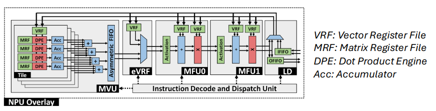
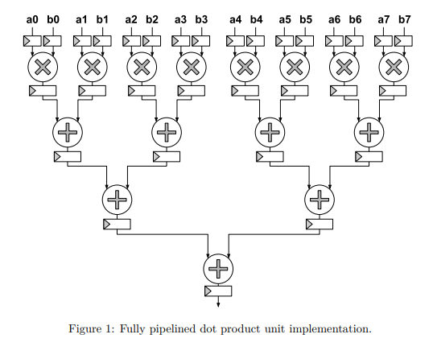

# Pipelined FPGA Matrix-Vector Multiplication Engine

### Parameterized SystemVerilog Accelerator with Deep Pipelining, Parallel Output Lanes, and FSM-Controlled Memory Access

**Course:** ECE 327 — Digital Hardware Systems, University of Waterloo  
**Team:** Mehak Khan & Hiya Patel  
**Platform:** AMD Kria KV260 — Zynq UltraScale+ MPSoC  
**Tools:** SystemVerilog, AMD Vivado/Vitis, XSim  
**Core Modules:** `mvm.sv`, `dot8.sv`, `accum.sv`, `ctrl.sv`, SRAM memory blocks  
**Target:** Functional matrix-vector multiplication with a clock-frequency target above 350 MHz  
**Repository:** [ECE 327 Group 44 Lab Repository](https://git.uwaterloo.ca/ece327-s26/group44-lab)

> **Designed and implemented a parameterized FPGA matrix-vector multiplication accelerator built from parallel 8-element dot-product engines, per-lane accumulators, SRAM-backed matrix/vector storage, and an FSM controller. The main challenge was not only making the arithmetic correct, but keeping memory reads, pipeline-valid signals, and accumulation boundaries aligned across a deeply pipelined multi-lane datapath.**

---

## Motivation

Matrix-vector multiplication is a fundamental compute operation in neural-network inference, digital signal processing, and other high-throughput numerical workloads.

For a matrix:

$$
\mathbf{A}
$$

and input vector:

$$
\mathbf{x}
$$

the accelerator computes:

$$
\mathbf{y} = \mathbf{A}\mathbf{x}
$$

where each output is a row-wise dot product:

$$
y_i = \sum_j A_{ij}x_j
$$

On an FPGA, this computation can be reorganized around parallel arithmetic rather than executing every multiply-accumulate sequentially.

The architecture developed for this project uses:

- A shared vector memory
- Multiple matrix memories
- Parallel 8-element dot-product engines
- Balanced adder trees
- Deep pipelining
- Per-lane accumulation
- Dedicated memory-address generation
- Explicit control/data latency matching

The goal was to build the complete MVM datapath and controller rather than only an isolated arithmetic block.

---

## Full MVM Architecture

The top-level accelerator contains one shared vector memory and a parameterized number of output lanes.

Each output lane contains:

1. A matrix memory
2. An 8-element dot-product engine
3. An accumulator

The controller supplies the read addresses and the control signals defining the first and last partial dot products belonging to each output row.



*Figure 1 — MVM architecture used as the system-level reference for the project. The relevant datapath consists of a shared vector register file feeding parallel matrix-register-file / dot-product / accumulator lanes.*

In the SystemVerilog implementation, the parallel lanes are generated structurally:

```systemverilog
genvar i;

generate
    for (i = 0; i < NUM_OLANES; i = i + 1) begin : olane
        ...
    end
endgenerate
```

Inside each generated lane, the design instantiates:

```text
Matrix Memory
     ↓
   dot8
     ↓
 Accumulator
     ↓
 Output Slice
```

The vector memory is shared across every lane:

```systemverilog
mem #(
    .DATAW(MEM_DATAW),
    .DEPTH(VEC_MEM_DEPTH)
) vec_mem_inst (
    .clk(clk),
    .waddr(i_vec_waddr),
    .wdata(i_vec_wdata),
    .wen(i_vec_wen),
    .raddr(vec_raddr),
    .rdata(vec_rdata)
);
```

Each lane has its own matrix memory:

```systemverilog
mem #(
    .DATAW(MEM_DATAW),
    .DEPTH(MAT_MEM_DEPTH)
) mat_mem_inst (
    .clk(clk),
    .waddr(i_mat_waddr),
    .wdata(i_mat_wdata),
    .wen(i_mat_wen[i]),
    .raddr(mat_raddr),
    .rdata(mat_rdata)
);
```

The architecture is parameterized through:

```systemverilog
NUM_OLANES
```

so the amount of output-level parallelism can be changed at synthesis time without redesigning the complete datapath.

---

## 8-Element Dot-Product Engine

The central arithmetic unit is `dot8`.

For two 8-element vectors:

$$
\mathbf{a} =
[a_0,a_1,a_2,a_3,a_4,a_5,a_6,a_7]
$$

and:

$$
\mathbf{b} =
[b_0,b_1,b_2,b_3,b_4,b_5,b_6,b_7]
$$

the module computes:

$$
y = \sum_{i=0}^{7} a_i b_i
$$

or:

$$
y =
a_0b_0 +
a_1b_1 +
a_2b_2 +
a_3b_3 +
a_4b_4 +
a_5b_5 +
a_6b_6 +
a_7b_7
$$



*Figure 2 — Fully pipelined 8-element dot-product unit. Eight multiplications execute in parallel before a balanced 4→2→1 binary adder tree reduces the products to one result. Registers separate the arithmetic stages.*

---

## Packed-Vector Unpacking

The two dot-product inputs enter as packed SystemVerilog vectors:

```systemverilog
input signed [8*IWIDTH-1:0] vec0,
input signed [8*IWIDTH-1:0] vec1
```

They are unpacked into eight signed elements using generated indexed part-selects:

```systemverilog
logic signed [IWIDTH-1:0] a [8];
logic signed [IWIDTH-1:0] b [8];

genvar i;

generate
    for (i = 0; i < 8; i++) begin
        assign a[i] = vec0[(i+1)*IWIDTH-1 -: IWIDTH];
    end
endgenerate
```

The same structure is used for `vec1`.

This produces eight independent signed operands from each packed input so all eight multiplications can execute in parallel.

---

## Balanced Reduction Tree

The first arithmetic level calculates:

```systemverilog
mult_res[0] = r_a0 * r_b0;
mult_res[1] = r_a1 * r_b1;
mult_res[2] = r_a2 * r_b2;
mult_res[3] = r_a3 * r_b3;
mult_res[4] = r_a4 * r_b4;
mult_res[5] = r_a5 * r_b5;
mult_res[6] = r_a6 * r_b6;
mult_res[7] = r_a7 * r_b7;
```

The eight products are then reduced using a balanced adder tree.

### First Reduction Level

```systemverilog
lvl0_add0 = r_mult0 + r_mult1;
lvl0_add1 = r_mult2 + r_mult3;
lvl0_add2 = r_mult4 + r_mult5;
lvl0_add3 = r_mult6 + r_mult7;
```

### Second Reduction Level

```systemverilog
lvl1_add0 = r_lvl0_add0 + r_lvl0_add1;
lvl1_add1 = r_lvl0_add2 + r_lvl0_add3;
```

### Final Reduction Level

```systemverilog
lvl2_add = r_lvl1_add0 + r_lvl1_add1;
```

The arithmetic therefore follows:

```text
8 multiplications
       ↓
    4 additions
       ↓
    2 additions
       ↓
    1 addition
       ↓
      result
```

A balanced reduction tree avoids placing seven additions in one serial dependency chain.

---

## Six-Cycle Dot-Product Pipeline

The final `dot8` implementation uses a **six-cycle registered datapath**.

The stages are:

```text
Cycle 1 — Register the eight input pairs
Cycle 2 — Register eight multiplication results
Cycle 3 — Register four first-level sums
Cycle 4 — Register two second-level sums
Cycle 5 — Register the final reduction sum
Cycle 6 — Register the output result
```

The output is therefore:

```systemverilog
assign result = r_c_add;
```

and the valid signal is delayed through six registers:

```systemverilog
r_ovalid0 <= ivalid;
r_ovalid1 <= r_ovalid0;
r_ovalid2 <= r_ovalid1;
r_ovalid3 <= r_ovalid2;
r_ovalid4 <= r_ovalid3;
r_ovalid5 <= r_ovalid4;
```

with:

```systemverilog
assign ovalid = r_ovalid5;
```

The important result is that the datapath has multi-cycle latency, but once filled it can continue accepting new input vector pairs on successive clock cycles.

---

## Arithmetic Bit-Width Growth

Intermediate widths were explicitly increased through the multiplier and reduction tree.

The multiplier results use:

```systemverilog
logic signed [2*IWIDTH:0] mult_res [0:7];
```

The first adder level is wider:

```systemverilog
logic signed [1+(2*IWIDTH):0]
    lvl0_add0,
    lvl0_add1,
    lvl0_add2,
    lvl0_add3;
```

The next level grows again:

```systemverilog
logic signed [2+(2*IWIDTH):0]
    lvl1_add0,
    lvl1_add1;
```

and the final reduction level uses:

```systemverilog
logic signed [3+(2*IWIDTH):0] lvl2_add;
```

Explicit bit-width management prevents intermediate arithmetic from being silently truncated as the reduction tree grows.

---

## FPGA Arithmetic Mapping

The dot-product implementation also provides synthesis guidance for arithmetic-resource mapping.

The multiplier signals are marked:

```systemverilog
(* use_dsp = "yes" *)
logic signed [2*IWIDTH:0] mult_res [0:7];
```

while the adder levels are marked:

```systemverilog
(* use_dsp = "no" *)
```

The intention is to encourage Vivado to map the multiplication work onto dedicated FPGA DSP resources while keeping the reduction tree in logic/carry resources.

This makes the arithmetic structure more deliberate than leaving every operation entirely to default synthesis heuristics.

---

# Partial-Sum Accumulator

An 8-element dot product is only one partial result when a matrix row contains more than eight scalar elements.

The accumulator therefore combines multiple dot-product outputs belonging to the same row.

The interface is:

```systemverilog
input signed [DATAW-1:0] data,
input ivalid,
input first,
input last,
output signed [ACCUMW-1:0] result,
output ovalid
```

The accumulator distinguishes three cases.

### First Partial Dot Product

```systemverilog
if (first)
    r_result <= data;
```

The running sum is initialized directly from the first partial result.

### Intermediate Partial Dot Products

```systemverilog
else
    r_result <= r_result + data;
```

Each additional dot product is added to the running sum.

### Final Partial Dot Product

When:

```systemverilog
last
```

is asserted, the completed row result becomes valid:

```systemverilog
if (last)
    r_ovalid <= 1;
```

Conceptually:

```text
dot8(chunk 0) ──┐
                │
dot8(chunk 1) ──┼──> running accumulation ──> final row result
                │
dot8(chunk N) ──┘
```

This allows the same eight-element compute block to process vectors and matrix rows larger than the physical dot-product width.

---

# MVM Controller

The controller is implemented as a two-state finite-state machine:

```systemverilog
typedef enum logic [0:0] {
    IDLE    = 1'b0,
    COMPUTE = 1'b1
} state_t;
```

The two states are:

- `IDLE`
- `COMPUTE`

---

## IDLE State

While idle, the controller waits for:

```systemverilog
start
```

When a new operation begins, it latches the complete operand description:

```systemverilog
r_vec_start_addr <= vec_start_addr;
r_vec_num_words <= vec_num_words;
r_mat_start_addr <= mat_start_addr;
r_mat_num_rows_per_olane <= mat_num_rows_per_olane;
```

The controller then enters:

```text
COMPUTE
```

This means the externally supplied configuration does not need to remain unchanged throughout the complete matrix-vector operation.

---

## Nested Row and Word Counters

The controller effectively implements two nested loops.

The inner loop is:

```systemverilog
word_cnt
```

which tracks the current vector word within a matrix row.

The outer loop is:

```systemverilog
row_cnt
```

which tracks the current matrix row.

The termination conditions are:

```systemverilog
assign last_word =
    (word_cnt == r_vec_num_words - 1'b1);

assign last_row =
    (row_cnt == r_mat_num_rows_per_olane - 1'b1);
```

The resulting control flow is conceptually equivalent to:

```text
for each matrix row:
    for each vector word:
        read vector word
        read matrix word
        compute partial dot product
        accumulate partial result
```

---

# Incremental Matrix Address Generation

One implementation detail I deliberately avoided was calculating the current matrix-row base as:

```text
row_cnt × vec_num_words
```

every cycle.

That would introduce an unnecessary multiplication into the controller datapath.

Instead, the controller stores:

```systemverilog
mat_row_base
```

and updates it only when a complete row has finished:

```systemverilog
mat_row_base <= mat_row_base + r_vec_num_words;
```

The current matrix address then becomes:

```systemverilog
assign mat_raddr =
    mat_row_base + word_cnt;
```

while the vector address is:

```systemverilog
assign vec_raddr =
    r_vec_start_addr + word_cnt;
```

This replaces repeated row-offset multiplication with an incremental addition.

---

# Accumulation Boundary Generation

The controller generates the boundaries required by the accumulator.

The first vector word of a row produces:

```systemverilog
assign accum_first =
    (state == COMPUTE) &&
    (word_cnt == '0);
```

The last vector word produces:

```systemverilog
assign accum_last =
    (state == COMPUTE) &&
    last_word;
```

The controller also indicates when computation is active:

```systemverilog
assign ovalid =
    (state == COMPUTE);

assign busy =
    (state == COMPUTE);
```

The controller itself therefore describes **which piece of the matrix/vector operation is being issued**.

The top-level MVM module is responsible for aligning those control signals with the delayed arithmetic results.

---

# Pipeline Alignment Across the Full MVM

This became one of the most important integration problems in the project.

The controller produces:

```text
vec_raddr
mat_raddr
accum_first
accum_last
ovalid
```

for the work being issued now.

However, the associated data does not immediately reach the accumulator.

There are two major latency components:

1. Memory-read latency
2. Dot-product pipeline latency

The top-level defines:

```systemverilog
localparam DOT8_LATENCY = 6;
```

The controller-valid signal is first delayed by one cycle before entering `dot8`:

```systemverilog
always_ff @(posedge clk or posedge rst) begin
    if (rst)
        dot8_ivalid <= 1'b0;
    else
        dot8_ivalid <= ctrl_ovalid;
end
```

This accounts for the memory-read stage before the dot-product input becomes valid.

The `first` and `last` accumulation markers therefore require:

```systemverilog
localparam int FIRST_LAST_DELAY =
    1 + DOT8_LATENCY;
```

which evaluates to:

```text
7 cycles
```

The alignment pipeline is:

```systemverilog
logic [FIRST_LAST_DELAY-1:0] first_pipe;
logic [FIRST_LAST_DELAY-1:0] last_pipe;
```

and the controller signals are shifted through it:

```systemverilog
first_pipe <= {
    first_pipe[FIRST_LAST_DELAY-2:0],
    ctrl_accum_first
};

last_pipe <= {
    last_pipe[FIRST_LAST_DELAY-2:0],
    ctrl_accum_last
};
```

The aligned versions are then:

```systemverilog
assign accum_first_aligned =
    first_pipe[FIRST_LAST_DELAY-1];

assign accum_last_aligned =
    last_pipe[FIRST_LAST_DELAY-1];
```

These signals finally enter the accumulator alongside the corresponding `dot_result`.

This is one of the most important system-level parts of the design:

> **The controller describes the operation when it is issued, while the accumulator needs the same control information several cycles later when the corresponding arithmetic result actually arrives.**

---

# Per-Lane Integration

Each generated output lane connects:

```text
Matrix Memory
     ↓
   dot8
     ↓
 Accumulator
     ↓
o_result slice
```

The dot-product engine receives the shared vector-memory output and the lane-specific matrix-memory output:

```systemverilog
dot8 #(
    .IWIDTH(IWIDTH),
    .OWIDTH(OWIDTH)
) dot8_inst (
    .clk(clk),
    .rst(rst),
    .vec0(vec_rdata),
    .vec1(mat_rdata),
    .ivalid(dot8_ivalid),
    .result(dot_result),
    .ovalid(dot_ovalid)
);
```

The corresponding accumulator receives:

```systemverilog
accum #(
    .DATAW(OWIDTH),
    .ACCUMW(OWIDTH)
) accum_inst (
    .clk(clk),
    .rst(rst),
    .data(dot_result),
    .ivalid(dot_ovalid),
    .first(accum_first_aligned),
    .last(accum_last_aligned),
    .result(accum_result),
    .ovalid(accum_ovalid)
);
```

Each lane then maps its output into the packed result bus:

```systemverilog
assign o_result[(i+1)*OWIDTH-1 -: OWIDTH]
    = accum_result;
```

Because all output lanes execute the same schedule in parallel, the valid signal from lane 0 is used as the top-level result-valid signal.

---

# Verification Strategy

I verified the design incrementally rather than beginning with the complete MVM top level.

The main stages were:

1. SRAM behavior
2. Dot-product functionality
3. Dot-product pipeline latency
4. Accumulation behavior
5. Controller address sequencing
6. Full MVM integration

For the dot-product unit, I created a standalone testbench that applied consecutive vector inputs.

Example stimulus included:

```systemverilog
vec0 = {8{8'd2}};
vec1 = {8{8'd2}};
ivalid = 1'b1;
```

followed on the next clock by:

```systemverilog
vec0 = {8{8'd3}};
vec1 = {8{8'd3}};
ivalid = 1'b1;
```

This was useful for checking not only the numerical result but also whether the pipelined `ovalid` signal appeared on the correct cycle.

---

# Integration Bug — Control / Top-Level Signal Mismatch

The most difficult bug appeared during integration of the controller and MVM top-level module.

A control connection used an inconsistent signal name between modules.

Instead of immediately producing an obvious functional error, the design created a bad connection and the resulting MVM output only began diverging partway through the computation.

That made the failure initially look like an address-sequencing or latency problem.

I traced the controller signals and top-level datapath cycle-by-cycle in the simulator until the incorrect connection was isolated.

This was a useful RTL debugging lesson because the individual arithmetic modules could all be correct while a single integration-level signal error still corrupted the complete accelerator.

If I were rebuilding the project, I would add:

```systemverilog
`default_nettype none
```

during development so accidental implicit nets become compilation errors rather than silently created wires.

I would also write a small self-checking controller testbench before connecting it to the complete MVM datapath.

---

# Timing-Oriented Design

The project was designed around the requirement to reach a high FPGA clock frequency.

Several architectural choices directly targeted timing.

---

## Deep Arithmetic Pipelining

The dot-product engine does not perform:

```text
multiply → add → add → add
```

within one clock cycle.

Instead, each major arithmetic level is separated by registers.

This reduces the amount of combinational logic between sequential boundaries.

---

## Balanced Addition

The eight products are reduced using:

```text
8 → 4 → 2 → 1
```

rather than a serial accumulation chain.

This reduces dependent adder depth.

---

## DSP-Guided Multiplication

The multiplication stage is explicitly marked with:

```systemverilog
(* use_dsp = "yes" *)
```

to encourage dedicated multiplier-resource inference.

The adder tree is separately marked to remain outside the DSP blocks.

---

## Low-Cost Controller Address Generation

The controller avoids recomputing:

```text
row × vector_length
```

on every cycle.

Instead:

```systemverilog
mat_row_base <=
    mat_row_base + r_vec_num_words;
```

updates the row base incrementally.

This keeps multiplication out of the address-generation path.

---

# Post-Implementation Analysis

After implementation in Vivado, the recorded critical datapath delay was:

**2.621 ns**

The critical path included FPGA primitives such as:

- `FDRE`
- `LUT6`
- `LUT3`
- `CARRY8`

The project target was above:

**350 MHz**

which corresponds to a nominal clock period of approximately:

$$
T = \frac{1}{350\text{ MHz}}
\approx 2.857\text{ ns}
$$

The recorded **2.621 ns** datapath delay was therefore below that nominal 350 MHz period.

The implementation notes recorded resource utilization of approximately:

| Resource | Utilization |
| --- | ---: |
| LUT | ~5% |
| LUTRAM | ~1% |
| Flip-Flops | ~1% |
| BRAM | ~6% |

The relatively low LUT and flip-flop utilization also showed that the architecture could be scaled through additional parallel output lanes rather than consuming the entire device with a single compute lane.

---

# Relation to Earlier Pipelining Work

Before the MVM accelerator, I implemented a deeply pipelined fixed-point hyperbolic-tangent circuit in the previous ECE 327 lab.

That design used:

- Q2.12 fixed-point arithmetic
- Multi-stage multiplication/addition
- Explicit delay lines for intermediate values
- An 18-stage valid delay followed by the registered output stage
- Two-cycle registered multiplication stages

That exercise was useful preparation for the MVM project because it exposed the main problem that reappeared at system level:

> **Every data value and every control signal must arrive at the stage where it is consumed on the same clock cycle.**

The MVM project extended that idea from a single mathematical pipeline to a complete accelerator containing memories, parallel compute lanes, accumulators, and a controller.

---

# Results

The completed project demonstrates:

- Parameterized SystemVerilog MVM architecture
- Shared vector memory
- Per-output-lane matrix memories
- Parallel generated output lanes
- 8-element signed dot-product engines
- Eight parallel multipliers per dot-product engine
- Balanced 4→2→1 adder reduction tree
- Six-cycle dot-product pipeline
- Pipelined valid propagation
- Explicit arithmetic bit-width growth
- DSP-oriented multiplier mapping
- Per-lane partial-sum accumulation
- `first` / `last` accumulation boundaries
- Two-state MVM control FSM
- Latched operation descriptors
- Nested row / word traversal
- Incremental matrix-row address generation
- One-cycle memory + six-cycle dot-product control alignment
- Full generated lane integration
- Cycle-level RTL debugging
- Post-implementation timing-path analysis
- Low FPGA resource utilization relative to the available device

The most important system-level result is the complete chain:

**Memory address generation**  
↓  
**Vector + matrix memory reads**  
↓  
**Eight-way parallel multiplication**  
↓  
**Pipelined adder reduction**  
↓  
**Partial dot product**  
↓  
**Row accumulation**  
↓  
**Parallel MVM outputs**

---

# What I Learned

The main lesson from this project was that high-frequency RTL design is not just about inserting registers into arithmetic.

The complete design has to treat **data movement, control movement, memory latency, and arithmetic latency as one timing problem**.

The `dot8` module could be verified independently and the controller could generate mathematically correct addresses, but the complete MVM still depended on `ivalid`, `first`, and `last` reaching the accumulator on exactly the same cycles as the corresponding dot-product results.

The project also reinforced several practical FPGA design ideas:

- Prefer balanced arithmetic structures over long dependency chains
- Pipeline according to actual combinational depth
- Explicitly track valid signals through every registered stage
- Consider memory latency as part of the datapath
- Avoid unnecessary arithmetic in control/address paths
- Inspect post-implementation timing rather than assuming RTL structure maps ideally
- Verify blocks individually before system integration
- Use stricter compile/lint settings to catch accidental implicit nets

---

# What I Would Improve Next

If I continued optimizing the design, I would investigate:

- More aggressive DSP48E2-aware multiply/add packing
- Explicit DSP primitive instantiation where useful
- Automated self-checking testbenches
- SystemVerilog assertions for pipeline/control alignment
- `default_nettype none` throughout the RTL
- Parameterized assertions for arbitrary `NUM_OLANES`
- Additional timing experiments across different output-lane counts
- Resource-versus-throughput sweeps
- Alternative reduction structures for larger dot-product widths
- More aggressive quantization / bit-width reduction
- Time-multiplexing versus spatial parallelism trade-offs
- Post-route timing comparisons for different DSP and carry-chain mappings

---

# Repository

The project source contains the main RTL blocks for:

- MVM top level
- 8-element dot product
- Accumulator
- MVM controller
- SRAM interfaces
- Simulation testbenches

**Repository:** [mvm-engine](https://git.uwaterloo.ca/ece327-s26/group44-lab)

> **Note:** The course GitLab repository may require University of Waterloo access. A public portfolio mirror can be added later if external source-code access is desired.
