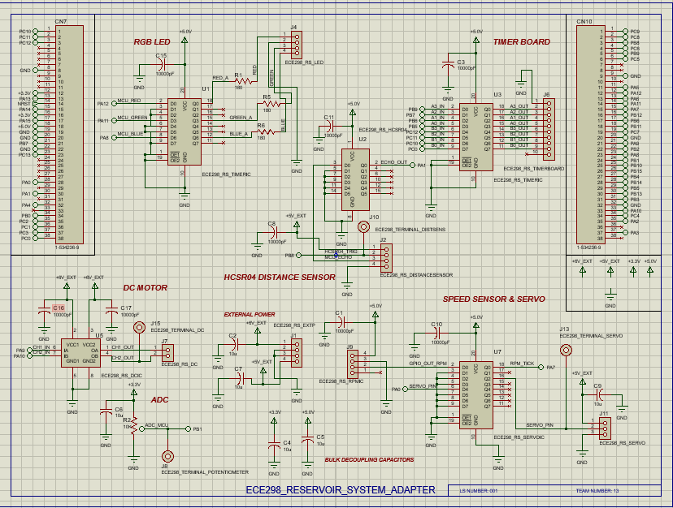
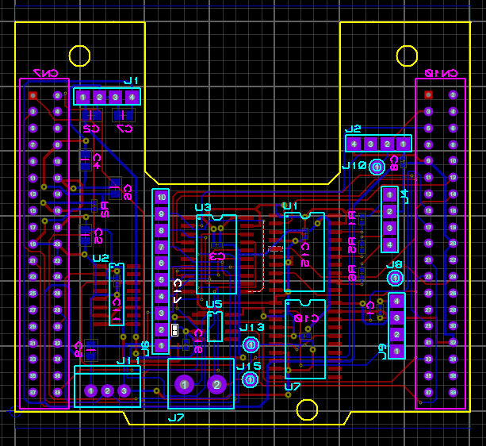
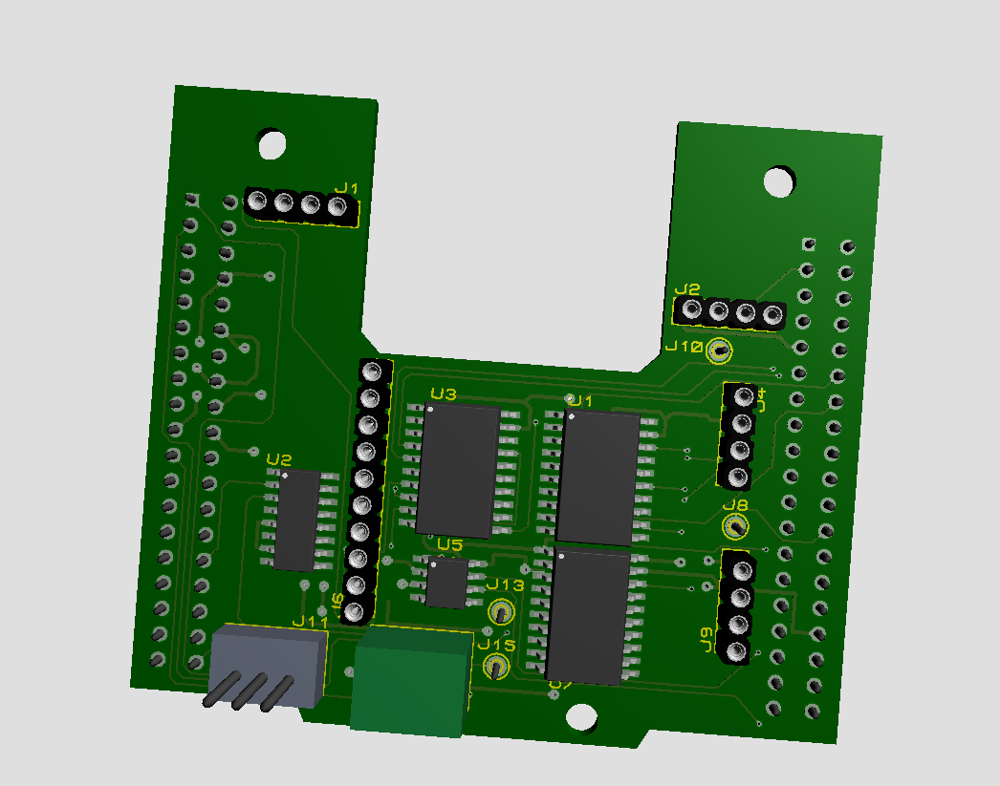
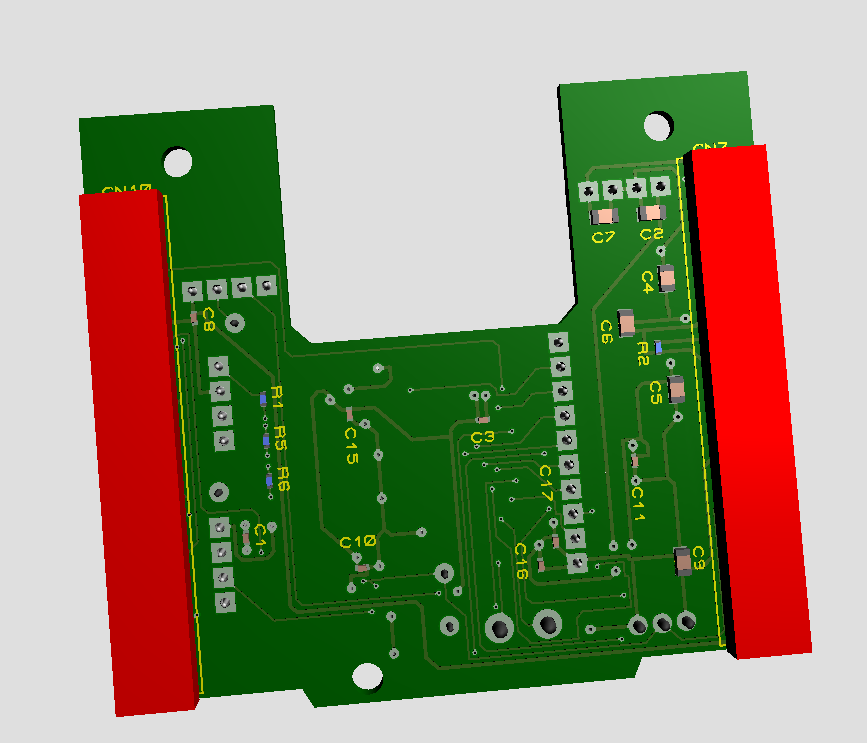

# STM32 Reservoir Control System

### Custom PCB + Embedded Firmware for Multi-Pipeline Reservoir Automation

**Course:** ECE 298 — University of Waterloo  
**Platform:** STM32F401RE  
**Tools:** Proteus Design Suite, STM32CubeIDE, STM32 HAL, Embedded C  
**Hardware:** Custom 2-layer PCB, DC motor, servo, HC-SR04 ultrasonic sensor, RPM sensor, RGB LED, ADC, timer/display interface  

> **Designed and implemented a custom STM32-based reservoir-control system combining a 2-layer interface PCB, motor and servo control, ultrasonic liquid-level sensing, RPM measurement, analog acquisition, display interfacing, and interrupt-driven embedded firmware.**

---

## System Overview

The project implements an automated reservoir and pipeline-control system built around an **STM32F401RE microcontroller**.

The system monitors reservoir depth, controls a pump, selects between pipelines using a servo, measures motor rotational speed, displays reservoir information, and executes user-configured operating schedules.

The complete system integrates:

- STM32F401RE microcontroller
- Custom 2-layer PCB
- DC motor and motor-driver stage
- Servo-controlled pipeline selection
- HC-SR04 ultrasonic distance sensor
- RPM / rotational-speed sensor
- Analog potentiometer input
- RGB status indicator
- External timer/display interface
- UART user interface
- External motor and logic-power interfaces

The overall operating path is:

**User configuration → schedule evaluation → pipeline selection → pump control → reservoir-level sensing → RPM measurement → status/display output**

---

## Hardware Architecture

The custom PCB acts as the electrical interface between the STM32 development board and the complete reservoir system.

The board connects to the STM32 through its expansion headers and centralizes the supporting circuitry for:

- DC motor drive
- Servo PWM control
- Ultrasonic ranging
- RPM measurement
- Analog acquisition
- RGB status indication
- External display output
- External power
- Digital buffering
- Sensor and actuator connectors

Instead of connecting each peripheral independently using jumper wiring, the PCB consolidates the reservoir system into a dedicated hardware platform.

---



*Figure 1 — Complete reservoir-system adapter schematic. The PCB integrates motor drive, ultrasonic sensing, servo control, RGB indication, analog acquisition, display interfacing, power distribution, and STM32 I/O.*

---

# Custom PCB Design

## STM32 Interface

The PCB was designed around the header geometry of the STM32 development board.

The two large expansion connectors route the required STM32 GPIO and peripheral signals into the custom circuitry.

These signals include:

- PWM outputs
- ADC input
- Timer input capture
- External interrupt input
- Digital GPIO
- Servo control
- Display outputs
- Motor-driver control

This allowed the STM32 development board to remain the central controller while the custom PCB handled the electrical interfaces to the physical reservoir system.

---

## DC Motor Interface

The reservoir pump is represented by a DC motor driven through an external motor-driver stage.

The motor circuitry is powered from an external supply while receiving low-voltage control signals from the STM32.

Two PWM-capable control signals allow the firmware to control motor operation.

The system supports several pump-speed commands:

- Low
- Medium
- High
- Variable analog-controlled speed

Motor PWM is generated using an STM32 hardware timer.

The control architecture is therefore:

**STM32 PWM → motor driver → DC motor**

This prevents the microcontroller from directly supplying motor current while still allowing software-controlled pump operation.

---

## Servo-Controlled Pipeline Selection

A servo represents physical selection between the reservoir's available pipelines.

The STM32 generates a PWM waveform and assigns different pulse widths to discrete servo positions.

The control path is:

**Pipeline command → STM32 timer PWM → servo position → selected pipeline**

Four servo positions correspond to four pipeline selections.

This allowed the software schedule to produce a physical electromechanical output.

---

## Ultrasonic Reservoir-Level Sensor

Reservoir depth is measured using an **HC-SR04 ultrasonic sensor**.

The STM32 generates a short trigger pulse and measures the duration of the returning echo.

The signal path is:

**Trigger pulse → ultrasonic transmission → reflection → echo pulse → STM32 timer capture → distance**

The sensor's echo duration is proportional to the round-trip travel time of the acoustic pulse.

Distance is calculated approximately as:

**Distance = (Echo Time × Speed of Sound) / 2**

Using the firmware's units:

**Distance ≈ (Time Difference × 0.0343) / 2**

The factor of two accounts for the acoustic wave travelling both toward the water surface and back toward the sensor.

The measured distance is then converted into a reservoir-depth estimate.

---

## Timer Input Capture

Rather than measuring the ultrasonic pulse width using blocking software delays, the project uses an STM32 hardware timer in **input-capture mode**.

The first edge stores the initial timer count:

```c
time_edge1 = HAL_TIM_ReadCapturedValue(htim, TIM_CHANNEL_2);
```

The second edge stores the final count:

```c
time_edge2 = HAL_TIM_ReadCapturedValue(htim, TIM_CHANNEL_2);
```

The pulse duration can then be determined from the difference between the two captures.

Conceptually:

**Δt = t<sub>falling</sub> − t<sub>rising</sub>**

and therefore:

**Distance ∝ Δt**

This allows the timer hardware to perform the timing-critical measurement without requiring the CPU to continuously poll the signal.

---

## RPM Measurement

A rotational-speed sensor produces pulse events while the motor is operating.

Each detected pulse generates an interrupt.

A simplified version of the interrupt logic is:

```c
void HAL_GPIO_EXTI_Callback(uint16_t GPIO_Pin)
{
    if (GPIO_Pin == RPM_TICK_Pin)
    {
        rpm_tick_count += 1;
    }
}
```

The number of pulses observed during a known measurement window is then used to estimate motor speed.

Conceptually:

**RPM ∝ Pulse Count / Measurement Time**

More generally, if the sensor generates **N** pulses per revolution:

**RPM = (Pulse Count / N) × (60 / Measurement Time)**

This gives the controller an actual measurement of motor behavior rather than relying only on the commanded PWM value.

---

## Analog Acquisition

An analog potentiometer is connected to an STM32 ADC input.

The potentiometer provides a continuously adjustable control value that can be converted into a motor PWM command.

The signal path is:

**Potentiometer voltage → STM32 ADC → digital value → PWM duty cycle → motor speed**

The ADC measurement is therefore used to map the analog input range onto the available motor-control range.

This added a variable-speed operating mode alongside the fixed software-defined pump settings.

---

## RGB Status Interface

An RGB LED provides immediate visual information about system state.

Different LED combinations represent different pipeline selections.

For example:

- Pipeline 0 → combined colour indication
- Pipeline 1 → red
- Pipeline 2 → green
- Pipeline 3 → blue
- Idle → LED off

The RGB output also provides warning behaviour when the reservoir reaches an empty condition.

This gives the system a local status interface without requiring the UART terminal.

---

## External Display Interface

The system interfaces with an external timer/display board.

The measured reservoir level is converted into decimal digits before being sent to the display circuitry.

For a value **D**:

**Ones = D mod 10**

**Tens = floor(D / 10)**

In firmware:

```c
ones = dp % 10;
tens = dp / 10;
```

Each decimal digit is then represented using four digital output bits.

This allowed reservoir-depth information to be displayed directly by the external hardware.

---

# Digital Interface Hardware

The reservoir system contains multiple external digital peripherals.

Rather than routing every signal directly between a peripheral and the STM32, the PCB includes dedicated digital interface devices.

The schematic incorporates buffer / interface ICs between several external signals and the microcontroller.

These devices help provide:

- Signal isolation
- Fan-out capability
- Logic interfacing
- More controlled loading of STM32 GPIO
- Centralized external connectivity

The PCB therefore acts as more than a passive breakout board — it contains the electrical circuitry required to integrate the complete embedded system.

---

# PCB Implementation

The complete schematic was translated into a custom **2-layer PCB**.

The board integrates:

- STM32 expansion headers
- Motor-driver circuitry
- Digital buffer devices
- HC-SR04 connector
- RPM-sensor connector
- Servo connector
- RGB interface
- Timer/display interface
- Analog ADC input
- External power connections
- Local decoupling capacitors
- Peripheral signal routing

The PCB shape was designed around the STM32 development-board geometry while maintaining access to external connectors and mounting points.

---



*Figure 2 — Routed 2-layer reservoir-system adapter PCB. Top- and bottom-layer routing connect the STM32 headers to the motor, sensor, servo, display, and power-interface circuitry.*

---

## PCB Routing

The board required routing several different types of electrical signals:

- PWM
- Analog ADC
- Digital GPIO
- Timer capture
- Interrupt inputs
- Sensor signals
- Servo control
- Motor-control signals
- External power
- Display signals

Component placement was organized around the physical interfaces of the system.

External connectors were positioned near board edges where practical, while digital interface circuitry was placed closer to the corresponding STM32 signals.

Local decoupling capacitors were included around digital circuitry and supply connections.

---



*Figure 3 — Front-side 3D render of the completed PCB design showing the STM32 expansion headers, interface ICs, external connectors, and board geometry.*

---



*Figure 4 — Rear-side 3D render showing underside circuitry, routing, and component placement.*

---

# Embedded Firmware Architecture

The final firmware combines several STM32 peripherals:

- GPIO
- ADC
- PWM
- UART
- External interrupts
- Timer interrupts
- Timer input capture
- Multiple hardware timers

The application is organized around three major operating modes:

```c
typedef enum {
    MODE_SETUP,
    MODE_RUN,
    MODE_EMPTY
} SystemMode;
```

The high-level system architecture is therefore:

**SETUP → RUN → EMPTY / continued RUN**

depending on user configuration and reservoir conditions.

---

# SETUP Mode

During setup, the user configures the operating schedule through the UART interface.

A pipeline configuration contains parameters such as:

```c
typedef struct {
    uint8_t pump_pwm;
    uint8_t pipeline;
    uint8_t first_hour;
    uint8_t last_hour;
} Pipeline_Config;
```

For each pipeline, the user can configure:

- Pipeline number
- Pump PWM setting
- Start time
- Stop time

Multiple pipeline configurations can then be stored and evaluated during RUN mode.

This allowed the system to execute a user-defined reservoir schedule instead of relying on one hard-coded operating sequence.

---

# RUN Mode

RUN mode executes the configured schedule and coordinates all sensing and actuation.

During operation the firmware:

1. Measures reservoir depth
2. Evaluates the active schedule
3. Determines which pipeline should operate
4. Positions the servo
5. Drives the DC motor
6. Measures RPM
7. Updates the RGB indicator
8. Updates the reservoir-level display
9. Reports system information over UART

The serial terminal provides system-level observability during testing.

Typical information includes:

**Clock | Pipeline | PWM | RPM | Reservoir Depth**

This was useful both as a user interface and as a debugging tool during system integration.

---

# EMPTY Mode

The firmware also contains a separate state for an empty-reservoir condition.

If the measured reservoir depth indicates that the reservoir has reached its lower operating limit while discharge is active, the system transitions into **MODE_EMPTY**.

The controller can then:

- Stop normal pump operation
- Move the servo toward a safe/default position
- Display an RGB warning
- Report the condition through UART

This prevents the normal scheduled-control logic from continuing blindly when the reservoir state is no longer valid.

---

# Timer Architecture

A key part of the project was assigning different real-time tasks to dedicated STM32 timer peripherals.

## TIM1 — DC Motor PWM

TIM1 generates PWM signals used to control the motor-driver circuit.

The PWM duty cycle determines the commanded pump speed.

---

## TIM2 — Servo PWM

TIM2 generates the pulse-width-controlled signal used for servo positioning.

Different compare values correspond to different pipeline selections.

---

## TIM4 — System Timing

A periodic timer interrupt provides the time base used by the operating schedule.

The high-level controller can compare the current simulated time against each configured pipeline's start and stop values.

---

## TIM5 — Ultrasonic Input Capture

TIM5 measures the rising and falling edges of the HC-SR04 echo signal.

The captured pulse width is converted into distance and then reservoir depth.

---

## TIM9 — RPM Measurement Window

A separate timer defines the measurement interval used for RPM estimation.

RPM sensor pulses are accumulated during the interval and converted into a rotational-speed estimate.

---

The complete real-time architecture is therefore approximately:

**TIM1 → Motor PWM**

**TIM2 → Servo PWM**

**TIM4 → System schedule**

**TIM5 → Ultrasonic timing**

**TIM9 → RPM measurement interval**

This distributes timing-sensitive work across hardware peripherals rather than implementing all timing using software delays.

---

# Subsystem-First Development

The complete reservoir firmware was not developed as one monolithic application from the beginning.

Individual subsystems were first developed and tested independently.

Separate development projects included:

- ADC acquisition
- RGB LED control
- UART communication
- DC motor PWM
- Servo control
- HC-SR04 distance measurement
- RPM sensing
- Timer operation
- Display / BCD output
- Basic GPIO testing

The development strategy was:

**Individual peripheral test → subsystem validation → combined firmware → complete system integration**

This made debugging significantly easier because a failure in the integrated application could be traced back to a previously validated subsystem.

---

# Engineering Challenge 1 — Coordinating Multiple Real-Time Peripherals

One of the main challenges was operating several peripherals with very different timing requirements.

The complete system required:

- Continuous motor PWM
- Servo PWM
- Microsecond-scale ultrasonic pulse measurement
- RPM pulse counting
- ADC acquisition
- Periodic schedule updates
- UART communication

A fully blocking software architecture would make these tasks difficult to coordinate.

Instead, timing-sensitive functions were assigned to dedicated STM32 peripherals.

For example:

**Motor control → hardware PWM**

**Servo control → hardware PWM**

**Ultrasonic measurement → timer input capture**

**RPM detection → external interrupt**

**System time → periodic timer interrupt**

This allowed the CPU to coordinate higher-level system behaviour while the hardware peripherals handled repetitive timing operations.

---

# Engineering Challenge 2 — Hardware / Firmware Co-Design

The project demonstrated that embedded-system development cannot be separated cleanly into "PCB work" and "firmware work."

Each firmware function depended on the electrical interface designed into the PCB.

For example:

**Motor PWM firmware**

required

**STM32 timer output → PCB routing → motor driver → external motor**

while ultrasonic sensing required:

**HC-SR04 → PCB interface → STM32 capture pin → timer peripheral → distance algorithm**

A firmware architecture can therefore be correct in isolation while still failing if the corresponding hardware interface is poorly designed.

The system had to be developed as one complete electrical and software architecture.

---

# Engineering Challenge 3 — Mixed Peripheral Interfaces

The board interfaces the STM32 with several different categories of hardware:

- Sensors
- Motors
- Servo actuators
- Analog inputs
- Digital displays
- External power
- Buffered digital signals

Each interface has different electrical and timing requirements.

This required considering:

- GPIO direction
- Voltage compatibility
- PWM timing
- ADC range
- Interrupt routing
- Timer peripheral mapping
- External supply connections
- Decoupling
- Physical connector placement

The project was therefore an exercise in **system integration**, not simply schematic capture.

---

# Engineering Challenge 4 — From Individual Tests to Full-System Integration

A peripheral functioning correctly by itself does not guarantee that the complete system will work after integration.

The final application had to combine:

- Timer callbacks
- External interrupts
- UART interaction
- Sensor measurements
- Motor control
- Servo positioning
- Display updates
- Schedule logic
- Empty-reservoir handling

under one application.

The final architecture separates high-level state control from low-level peripheral timing.

Conceptually:

**Hardware peripherals → measurements/events → system state machine → actuator commands**

This structure made the integrated firmware easier to reason about and debug.

---

# Physical Implementation

The PCB design was taken beyond schematic capture and layout into physical assembly.

The custom board was soldered and integrated with the reservoir-control hardware.

This provided practical experience with the difference between a PCB that is electrically correct in a CAD environment and one that must function as a real physical system.

The complete development cycle included:

**Schematic capture → PCB layout → fabrication → soldering / assembly → firmware integration → hardware testing**

This was one of my first projects involving the complete PCB-development workflow rather than working only with development boards.

---

# What This Project Added Beyond Development Boards

Using a development board makes it possible to prototype embedded firmware quickly, but a complete embedded product requires additional hardware.

The custom PCB handled the system-level integration that would otherwise require a large amount of external wiring.

This included:

- Signal routing
- External connectors
- Motor-driver interfacing
- Peripheral buffering
- Power connectivity
- Sensor interfaces
- Display interfaces
- Physical organization of the electrical system

The project therefore helped bridge the gap between:

**MCU peripheral programming**

and

**complete embedded hardware-system design**

---

# Results

The completed project demonstrated:

- Custom **2-layer PCB design and routing**
- STM32F401RE hardware integration
- Physical PCB assembly and soldering
- DC-motor PWM control
- Servo-based pipeline selection
- HC-SR04 ultrasonic reservoir-level measurement
- Timer input-capture firmware
- Interrupt-based RPM sensing
- Analog ADC acquisition
- RGB status indication
- External display interfacing
- UART configuration and debugging
- Multi-timer embedded architecture
- SETUP / RUN / EMPTY system-state control
- User-configurable pipeline scheduling
- Individual subsystem testing before integration
- Hardware / firmware co-design
- Integration of sensors, actuators, digital interfaces, and power circuitry onto one custom PCB

---

# What I Learned

This project was an early introduction to the complete embedded hardware-development cycle.

The most important lessons were:

- Translating system requirements into a schematic
- Designing a PCB around real mechanical and connector constraints
- Routing analog, digital, actuator-control, and power signals
- Using decoupling around digital circuitry
- Designing interfaces between an MCU and external peripherals
- Configuring STM32 hardware timers
- Using PWM for motors and servos
- Measuring physical signals with input capture
- Using interrupts for asynchronous events
- Using ADCs to convert physical analog inputs into control values
- Debugging subsystems before full integration
- Coordinating multiple real-time peripherals
- Designing firmware and hardware together
- Soldering and integrating a custom PCB
- Moving from a development-board prototype toward a dedicated embedded system

The biggest takeaway was that embedded engineering is fundamentally a **system-level discipline**.

A working design requires the PCB, firmware, sensors, actuators, power system, timing architecture, and physical interfaces to function together.

---

# Project Summary

The final system combines:

**Custom PCB**

↓

**STM32F401RE**

↓

**ADC + GPIO + PWM + UART + interrupts + timer capture**

↓

**Ultrasonic sensing + RPM sensing**

↓

**Motor + servo actuation**

↓

**Pipeline scheduling + reservoir-state control**

↓

**RGB + display + UART feedback**

The project provided hands-on experience taking an embedded-control concept through **schematic design, PCB layout, physical assembly, firmware development, and system integration**.