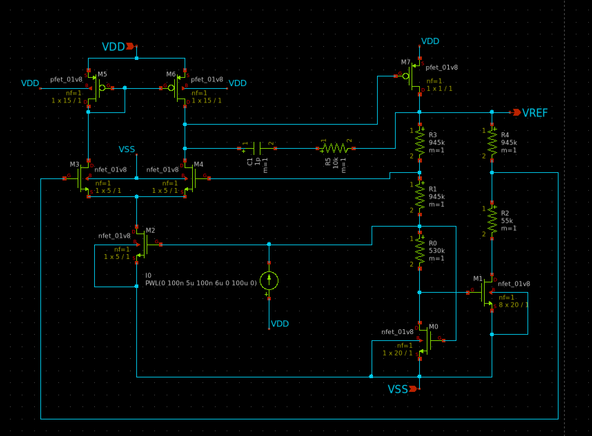
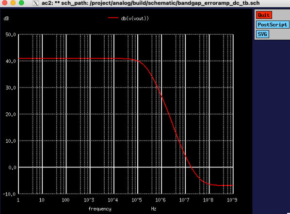
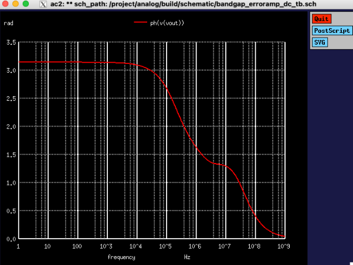
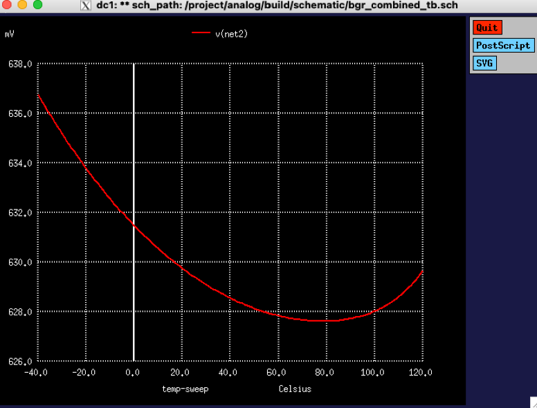
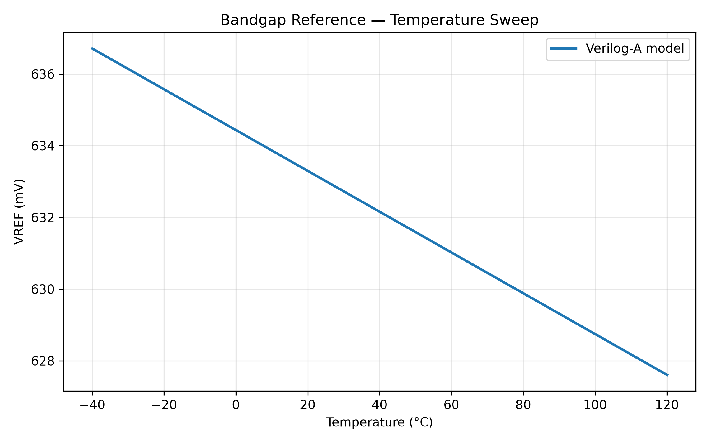
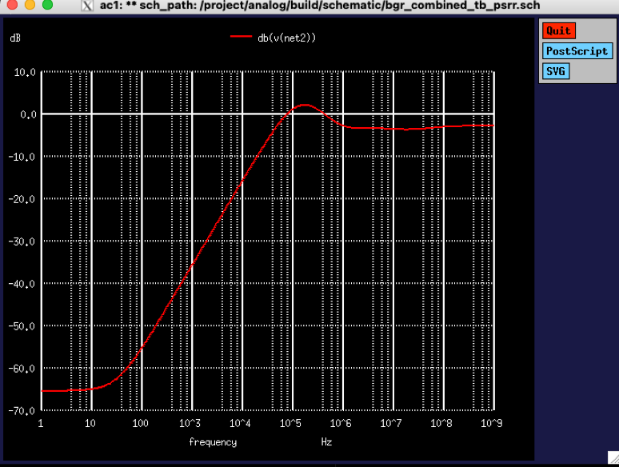
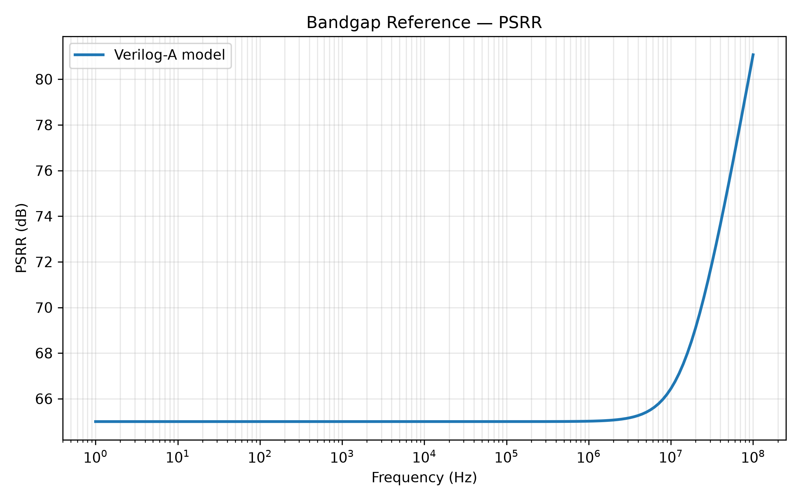

# PDK-Agnostic Subthreshold Bandgap Voltage Reference
### Analog IC Design — UWASIC / Tiny Tapeout

**Project:** UWASIC — University of Waterloo Analog & Systems IC Design Team  
**Team:** Mehak Khan, Zoey Situ — with design review from Henry Wu  
**Target:** Tiny Tapeout submission — bandgap reference + PLL system  
**Tools:** Xschem, ngspice, SKY130 PDK, Verilog-A, OpenVAF, Python/Matplotlib  

**Status:** Active — transistor-level BGR operational; Verilog-A behavioral model validated; PSRR optimization and physical-budget verification ongoing.

---

## Problem

Design a temperature-stable voltage reference using a **MOSFET-only subthreshold topology**, avoiding dependence on process-specific bipolar devices and making the design methodology suitable for adaptation across CMOS PDKs.

The reference targets operation over approximately **−40°C to 120°C** in the SKY130 process and forms part of a larger mixed-signal Tiny Tapeout system containing the bandgap reference and PLL.

---

## Circuit Architecture

The reference uses MOSFETs biased in weak inversion to generate complementary temperature-dependent voltages.

The core combines:

- a **CTAT** voltage that decreases with temperature;
- a **PTAT** voltage generated from the difference in gate-source voltage between differently sized subthreshold MOSFETs;
- resistor scaling to weight the PTAT contribution;
- an error amplifier that regulates the internal branch operating point.

<!-- Replace with your actual schematic image -->


*Final transistor-level MOSFET subthreshold bandgap reference implemented and simulated in Xschem/ngspice using the SKY130 PDK.*

---

## Approach

### MOSFET Subthreshold Bandgap Principle

The reference combines two temperature-dependent quantities with opposing slopes:

- **CTAT:** a gate-source voltage that decreases with temperature.
- **PTAT:** a ΔVGS generated between differently sized MOSFETs operating in subthreshold.

In weak inversion, MOSFET drain current has an approximately exponential dependence on gate voltage, allowing a ΔVGS-based PTAT term to be generated in a manner analogous to the ΔVBE principle used in conventional BJT bandgap references.

The PTAT contribution is weighted against the CTAT term using resistor ratios so that their first-order temperature coefficients approximately cancel.

---

### SKY130 Device Characterization

Rather than directly reusing device constants from the reference topology, I characterized the SKY130 devices before sizing the BGR.

Subthreshold sweeps were used to determine:

- **Subthreshold slope factor:** η ≈ **1.48**
- **CTAT slope:** ∂VGS/∂T ≈ **−0.63 mV/°C**
- Appropriate weak-inversion bias-current range of approximately **3–5 nA** for the selected device sizing.

This matters because once the devices leave weak inversion, the exponential model underlying the PTAT design equations becomes increasingly inaccurate.

I also performed **gm/ID and LUT-based device characterization** to support transistor sizing using process-specific simulation data.

---

### Temperature-Stability Iteration

The first working implementation showed excessive PTAT contribution, indicating incomplete cancellation between the PTAT and CTAT components.

I investigated the resistor ratio

\[
\frac{R_1 + R_3}{R_0}
\]

and initially increased `R0` to reduce the PTAT contribution.

When this produced little change in the simulated temperature dependence, I revisited the circuit topology, removed PMOS device `M7`, and recalculated resistor values using measured SKY130 subthreshold parameters rather than relying on process constants from the original reference design.

---

## Error Amplifier

The BGR uses an error amplifier to regulate the internal branches and establish the required operating point.

Amplifier characterization included:

- DC operating-point verification;
- transistor-region checks;
- correction of a tail-current-source biasing issue;
- DC transfer analysis;
- AC gain and bandwidth analysis.

The amplifier achieved approximately:

- **41 dB low-frequency gain**
- first dominant pole around **200–500 kHz**
- approximately **10 MHz unity-gain frequency**

<!-- Replace with actual amplifier AC plot -->



*Error-amplifier AC response used to investigate loop bandwidth, compensation, and the frequency dependence of BGR PSRR.*

---

## Behavioral Verilog-A Model

I integrated and validated a behavioral Verilog-A representation of the bandgap for system-level simulation.

The model includes configurable:

- nominal reference voltage;
- temperature coefficient;
- nominal temperature;
- supply sensitivity / PSRR;
- output resistance;
- output capacitance;
- white noise;
- flicker noise.

The model was compiled using **OpenVAF 23.5.0** into OSDI and simulated using **ngspice 45**.

Using parameters extracted from the transistor-level BGR, I verified:

- **VREF = 632.9 mV at 27°C**
- operation across **−40°C to 120°C**
- approximately **65 dB low-frequency PSRR**

The behavioral model was then compared with the transistor-level implementation to quantify deviations from idealized system-level behavior.

---

# Results

## Temperature Stability

The transistor-level reference produces approximately:

**VREF ≈ 630 mV**

over the operating range.

Across the **−40°C to 120°C** sweep, the total peak-to-peak reference variation is approximately:

**ΔVREF ≈ 9 mV**

corresponding to an effective temperature coefficient of approximately:

**89 ppm/°C**

The transistor-level result exhibits second-order temperature curvature rather than a purely linear temperature dependence.

<!-- Original transistor simulation -->


*Transistor-level SKY130 temperature sweep from −40°C to 120°C.*

The Verilog-A behavioral model provides a simplified system-level reference against which the transistor implementation can be compared.



*Behavioral Verilog-A model compared with the transistor-level BGR. The transistor implementation shows curvature that is not captured by the first-order behavioral temperature model.*

---

## Power-Supply Rejection

At low frequency:

**PSRR ≈ 65 dB at 1–10 Hz**

which exceeds the target specification of approximately **40 dB**.

However, transistor-level AC analysis reveals significant frequency-dependent degradation:

- strong reduction in rejection as frequency increases;
- approximately **+2 dB supply-to-output peaking around 100–150 kHz**;
- approximately **−3 dB supply coupling at frequencies above ~1 MHz**.

<!-- Original ngspice PSRR plot -->


*Transistor-level supply-to-reference transfer response. The low-frequency rejection is strong, but loop peaking appears around 100–150 kHz.*

The behavioral Verilog-A model maintains approximately **65 dB PSRR around 100 kHz**, exposing the difference between the idealized model and the real feedback-loop dynamics.



*Behavioral and transistor-level supply coupling. The large divergence around 100–150 kHz highlights the error-amplifier/compensation dynamics that are absent from the simplified behavioral model.*

---

## Key Results

| Metric | Result |
|---|---:|
| Nominal VREF | ~630–633 mV |
| Temperature range | −40°C to 120°C |
| VREF variation | ~9 mV peak-to-peak |
| Effective temperature coefficient | ~89 ppm/°C |
| Low-frequency PSRR | ~65 dB |
| Error-amplifier low-frequency gain | ~41 dB |
| Error-amplifier unity-gain frequency | ~10 MHz |
| Verilog-A nominal VREF | 632.9 mV |
| Behavioral-model LF PSRR | 65 dB |

---

## Design Methodology

Rather than relying entirely on values taken from the original reference design, the BGR was sized using **SKY130 device characterization**, including subthreshold and gm/ID measurements.

This creates a design methodology intended to make the topology easier to **re-characterize and migrate across different CMOS processes**.

The workflow was approximately:

```text
SKY130 device characterization
            ↓
Extract η, CTAT slope and weak-inversion range
            ↓
Derive PTAT/CTAT weighting
            ↓
Size MOSFETs and resistors
            ↓
Verify DC operating point
            ↓
Temperature sweep
            ↓
Error-amplifier AC characterization
            ↓
PSRR analysis
            ↓
Verilog-A behavioral model
            ↓
Behavioral vs transistor-level comparison
            ↓
Physical / thermal / reliability verification