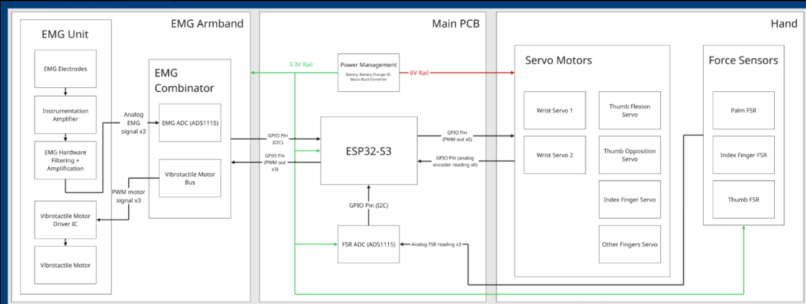
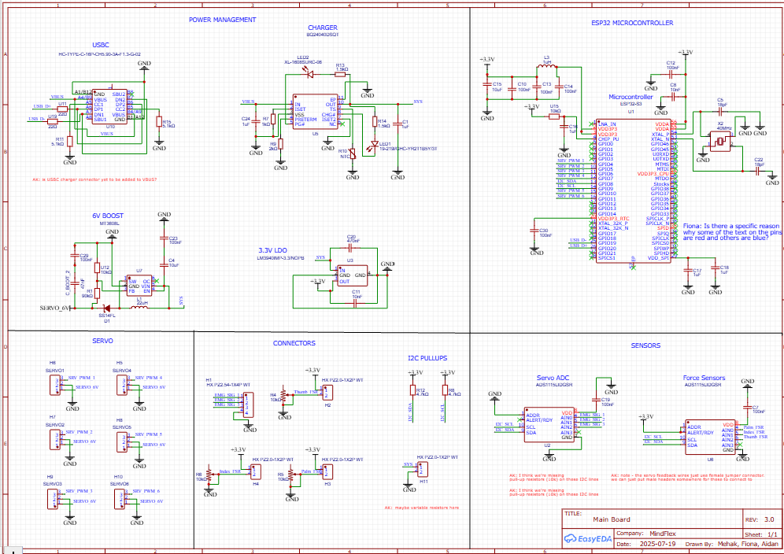
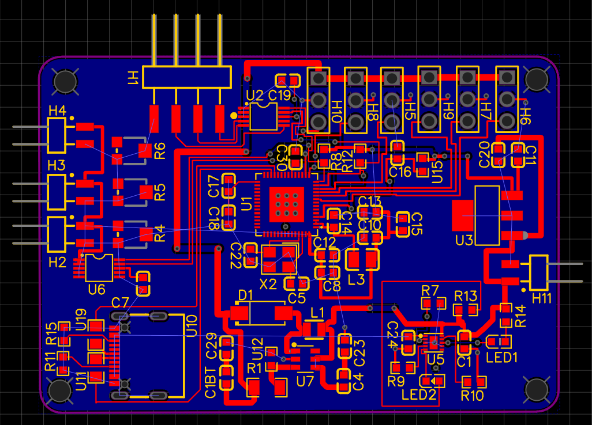

# Watolink — Main PCB for an EMG-Controlled Prosthetic Hand

**Project:** Watolink / MindFlex — wearable biosignal-controlled prosthetic hand  
**Role:** Hardware Lead  
**Team:** Mehak Khan, Fiona, Aidan  
**Tools:** EasyEDA, ESP32-S3, ADS1115, mixed-signal PCB design, 2-layer PCB  
**Status:** Main PCB designed and reviewed; fabrication/bring-up pending. EMG signal-integrity improvement under development.

> **Designed the central control and power PCB for a wearable EMG-controlled prosthetic hand, integrating battery charging, 6 V servo power, 3.3 V digital power, an ESP32-S3, dual ADS1115 ADCs, six servo interfaces, force-sensor acquisition, and I²C communication on a 2-layer board.**

---

## System Architecture

Watolink converts muscle activity from a wearable EMG armband into physical movement of a prosthetic hand while returning grip information through force sensing and vibrotactile feedback.

The complete system is divided into three hardware modules:

### 1. EMG Armband

Surface electrodes acquire low-amplitude differential EMG signals from the user's muscles. The analog front end performs:

**Electrodes → instrumentation amplification → analog filtering/amplification → ADS1115 ADC → digital EMG data**

The armband also contains vibrotactile motors so information from the prosthetic hand can be returned to the user as haptic feedback.

### 2. Main PCB

The Main PCB is the electrical hub of the system and was the primary focus of my hardware work.

It contains:

- ESP32-S3 microcontroller
- USB-C interface
- Li-ion battery charging
- 6 V switching supply for the servo motors
- 3.3 V regulated logic supply
- Six PWM servo-control outputs
- I²C communication
- ADS1115 ADC for servo-position / feedback signals
- ADS1115 ADC for force-sensitive resistor acquisition
- Connectors between the armband, prosthetic hand, sensors, and power system

The ESP32-S3 receives digitized muscle-intent data, generates PWM commands for the prosthetic hand, samples feedback sensors, and coordinates the closed-loop system.

### 3. Prosthetic Hand

The hand contains six servo-driven channels for physical actuation, including:

- Wrist servo channels
- Thumb flexion
- Thumb opposition
- Index-finger actuation
- Remaining-finger actuation

Three force-sensitive resistors located at the **palm, index finger, and thumb** provide grip-force information to the Main PCB.

The overall signal path is:

**Muscle contraction → EMG acquisition → digital interpretation → ESP32-S3 → servo motion → grip force sensing → feedback**

---

*Figure 1 — Watolink system architecture. The EMG armband acquires muscle activity and provides vibrotactile feedback, while the ESP32-S3 Main PCB coordinates sensor acquisition and six-channel servo control of the prosthetic hand.*

---

## Main PCB Electrical Design

The Main PCB combines power management, embedded control, sensor acquisition, and electromechanical interfaces onto a single 2-layer board.

A major challenge was supporting two very different types of loads:

- Low-voltage MCU and sensing electronics
- Higher-current servo motors

To handle this, the board separates the system into a **3.3 V logic domain** and a **6 V servo-power domain**.

---

## Power Architecture

### USB-C Input

The board uses USB-C as its external interface.

The schematic includes the required USB-C configuration resistors and routes the USB data pair toward the ESP32-S3 interface.

USB-C provides a compact interface for system power, programming, and communication.

---

### Battery Charging

Battery charging is handled by the **BQ24040**.

An important design change occurred during development.

The charger originally specified for the system was a **BQ2560-family device**, but the available package was impractical to route within the fabrication and routing constraints of the 2-layer PCB.

Instead of forcing a difficult layout or increasing PCB complexity, I re-evaluated the charging requirements and replaced it with the **BQ24040**, which provided the required charging functionality in a significantly more practical package.

This was not simply a schematic component substitution.

It was a manufacturability decision balancing:

- Electrical requirements
- Package geometry
- Routing density
- PCB layer count
- Fabrication complexity
- Reliability of assembly

---

### 6 V Servo Supply

The servo motors are powered from a dedicated **6 V switching-converter rail**.

Servo motors can generate substantially larger and more dynamic current loads than the microcontroller and sensing electronics, so they are not powered directly from the 3.3 V logic supply.

The converter section contains the switching regulator, inductor, diode, feedback network, and decoupling/bulk capacitance required to generate the servo rail.

Separating servo power from the logic supply also helps reduce the direct coupling of motor-induced voltage disturbances into the digital and analog electronics.

---

### 3.3 V Logic Supply

A dedicated **3.3 V regulator** supplies the low-voltage electronics, including:

- ESP32-S3
- ADS1115 ADCs
- I²C interfaces
- Force-sensor circuitry
- Supporting digital electronics

This provides a stable logic supply independent of the higher-current servo rail.

---

## ESP32-S3 Control System

The **ESP32-S3** acts as the central coordinator for the prosthetic-hand system.

The surrounding circuit includes the support hardware required for operation rather than treating the MCU as an isolated module.

The design includes:

- 3.3 V supply connections
- Local decoupling capacitors
- 40 MHz crystal
- Crystal loading capacitors
- GPIO routing
- I²C communication
- Six PWM outputs
- Sensor interfaces
- Servo interfaces

Six GPIO outputs are routed to external servo connectors and provide PWM control for the hand's actuators.

The microcontroller also communicates with the ADC circuitry through a shared I²C bus.

---

## Sensor Acquisition

Two **ADS1115 16-bit ADCs** are integrated into the Main PCB.

### Force-Sensor ADC

One ADS1115 acquires three force-sensitive resistor channels:

- Palm FSR
- Index-finger FSR
- Thumb FSR

These sensors provide information about contact and grip force.

Instead of controlling the hand purely open-loop, the microcontroller can use this information as feedback about how strongly the prosthetic hand is interacting with an object.

---

### Servo Feedback ADC

A second ADS1115 provides additional analog acquisition for servo-position / feedback signals.

Using external ADCs allows multiple analog signals to be measured without consuming a large number of MCU analog inputs.

Both ADCs communicate with the ESP32-S3 over the system's I²C bus.

I²C pull-up resistors are provided on the Main PCB for reliable bus operation.

---

*Figure 2 — Main PCB schematic. The board integrates USB-C, battery charging, a dedicated 6 V servo supply, 3.3 V logic regulation, ESP32-S3 support circuitry, six servo interfaces, I²C communication, and two ADS1115 ADCs for feedback acquisition.*

---

## PCB Implementation

I translated the complete schematic into a **2-layer PCB**.

The board combines several electrically different subsystems:

- Switching power conversion
- Battery charging
- USB
- ESP32-S3 digital circuitry
- Crystal oscillator circuitry
- Two ADCs
- Six servo interfaces
- Multiple sensor connectors
- I²C routing
- Higher-current servo power
- Low-voltage sensing electronics

Fitting these functions onto a 2-layer board required balancing routing density, connector access, component placement, power delivery, and manufacturability.

Particular attention was required around:

- ESP32-S3 fan-out
- Servo power routing
- Switching-converter components
- ADC routing
- Sensor connections
- Connector placement
- Decoupling capacitor placement
- Keeping high-current routes practical
- Maintaining a mechanically usable board shape

The completed layout integrates the majority of the prosthetic hand's control electronics onto one central PCB instead of relying on multiple separate development boards.

---

*Figure 3 — Completed 2-layer Main PCB layout. Top-layer copper is shown in red and bottom-layer copper in blue. The layout integrates the MCU, power conversion, ADCs, sensor acquisition, servo interfaces, and external connectors onto a single board.*

---

## Engineering Problem 1 — Designing for Manufacturability

One of the most important design lessons came from the battery charger.

The original charger selection satisfied the electrical requirements but introduced a fabrication problem.

The initially specified charger used a wafer-scale / very fine-pitch package whose geometry and routing requirements were poorly suited to the project's 2-layer PCB constraints.

At that point, the options were effectively:

1. Increase PCB fabrication complexity
2. Attempt significantly tighter routing
3. Select a charger better suited to the actual manufacturing process

I chose the third approach.

The charging circuit was redesigned around the **BQ24040**, retaining the required charging functionality while significantly improving routability and manufacturability.

This demonstrated an important hardware-design principle:

> A component is not a good design choice simply because its electrical specifications are suitable — its package, assembly requirements, routing complexity, cost, and manufacturing process must also match the system.

---

## Engineering Problem 2 — EMG Signal Integrity

During testing of the EMG acquisition system, the measured muscle-signal data showed unacceptable noise and inaccurate readings.

One proposed workaround was to add additional sensing channels and use redundancy.

However, this would have increased:

- Component count
- Cost
- ADC requirements
- Electrode count
- System complexity

without necessarily correcting the underlying reason that the original channels were inaccurate.

I instead investigated the problem from the analog signal path.

A leading mechanism being investigated is **electrode-to-skin impedance mismatch** at the differential EMG inputs.

Surface EMG electrodes do not behave as ideal zero-impedance voltage sources.

Each electrode-to-skin interface presents a source impedance that can vary with factors such as:

- Electrode contact
- Skin condition
- Motion
- Pressure
- Electrode placement

The absolute impedance itself is not the only problem.

What matters significantly for differential measurement is the **difference in impedance between the two inputs**.

---

## Why Electrode-Impedance Mismatch Matters

A differential instrumentation amplifier ideally measures:

\[
V_{EMG}=V_{+}-V_{-}
\]

while rejecting voltage that appears equally on both inputs.

That shared voltage is known as the **common-mode signal**.

Ideally:

\[
V_{CM}\rightarrow\text{rejected}
\]

However, if the two source impedances are unequal, the common-mode signal can produce different voltages at the two amplifier inputs.

The common-mode interference can therefore be partially converted into a differential error:

\[
V_{CM}\rightarrow V_{error,diff}
\]

Once the interference has become differential, the instrumentation amplifier can no longer reject it as effectively.

The result can appear as:

- Increased noise
- Motion artifact
- Baseline instability
- Reduced effective common-mode rejection
- Inaccurate EMG amplitude measurements

This points toward an **analog front-end impedance problem** rather than simply a lack of ADC channels.

---

## Proposed Analog-Front-End Improvement

The improvement currently under development is **active buffering at the electrodes**.

Instead of connecting each electrode directly to the instrumentation amplifier:

**Electrode → instrumentation amplifier**

the proposed architecture becomes:

**Electrode → unity-gain buffer → instrumentation amplifier**

for each differential input.

The buffer should have:

- Very high input impedance
- Low input bias current
- Low output impedance
- Low noise
- Suitable low-voltage operation

Because the buffer draws very little current from the electrode, it minimizes loading of the electrode-to-skin interface.

At its output, however, it presents a much lower and more consistent source impedance to the instrumentation amplifier.

Conceptually:

\[
Z_{electrode}\gg Z_{buffer,out}
\]

This reduces how strongly variations in electrode impedance influence the differential amplifier input conditions.

The aim is therefore not to physically "match" the electrode impedances.

Instead, the goal is to **electrically isolate the instrumentation amplifier from those variable source impedances**.

---

## Why Not Passive Impedance Matching?

A passive impedance-matching network might initially seem like an alternative.

However, the problem here is different from classical RF or transmission-line impedance matching.

The electrode-to-skin impedance is:

- Variable
- User-dependent
- Motion-dependent
- Frequency-dependent
- Difficult to predict accurately

A fixed passive network cannot reliably force two changing biological interfaces to maintain identical impedances.

Active buffering is therefore a more appropriate approach because it reduces the dependency of the instrumentation amplifier input on the electrode source impedance itself.

---

## Validation Plan

The buffering hypothesis still needs to be experimentally validated.

The next step is to compare the original and modified analog front ends under the same measurement conditions.

### Original

**Electrode → instrumentation amplifier → filtering → ADC**

### Modified

**Electrode → high-input-impedance buffer → instrumentation amplifier → filtering → ADC**

The comparison will examine:

- Noise amplitude
- Signal stability
- Motion artifact
- Baseline drift
- Repeatability
- Effective EMG signal quality

This provides a quantitative way to determine whether buffering produces a meaningful improvement rather than assuming that the proposed fix is correct.

---

## Results

- Designed the complete **2-layer Main PCB** for an EMG-controlled prosthetic-hand system.
- Integrated **USB-C, battery charging, 6 V servo power, 3.3 V logic regulation, ESP32-S3 control, dual ADS1115 ADCs, force sensing, I²C, and six servo channels**.
- Converted the system-level prosthetic-hand architecture into a manufacturable central PCB.
- Resolved a battery-charger package and routing constraint by selecting a more fabrication-compatible device.
- Routed a mixed-signal and relatively high-current system within a 2-layer PCB constraint.
- Integrated external sensor, servo, armband, power, and programming connections.
- Investigated inaccurate EMG acquisition at the analog-interface level instead of immediately increasing sensor count.
- Identified electrode source-impedance imbalance as a leading mechanism for degraded differential measurement.
- Developed an active-buffering approach intended to isolate electrode impedance variation from the instrumentation amplifier.

---

## Current Work

- Fabricate and electrically bring up the Main PCB
- Verify the 3.3 V logic rail
- Verify the 6 V servo rail under realistic motor loads
- Confirm battery-charging behaviour
- Validate ESP32-S3 programming and startup
- Validate the 40 MHz oscillator
- Test all six PWM servo outputs
- Validate both ADS1115 devices on the shared I²C bus
- Characterize force-sensor acquisition
- Prototype the buffered EMG input stage
- Compare buffered and unbuffered EMG signals quantitatively
- Integrate the Main PCB, EMG armband, and prosthetic hand into the complete closed-loop system